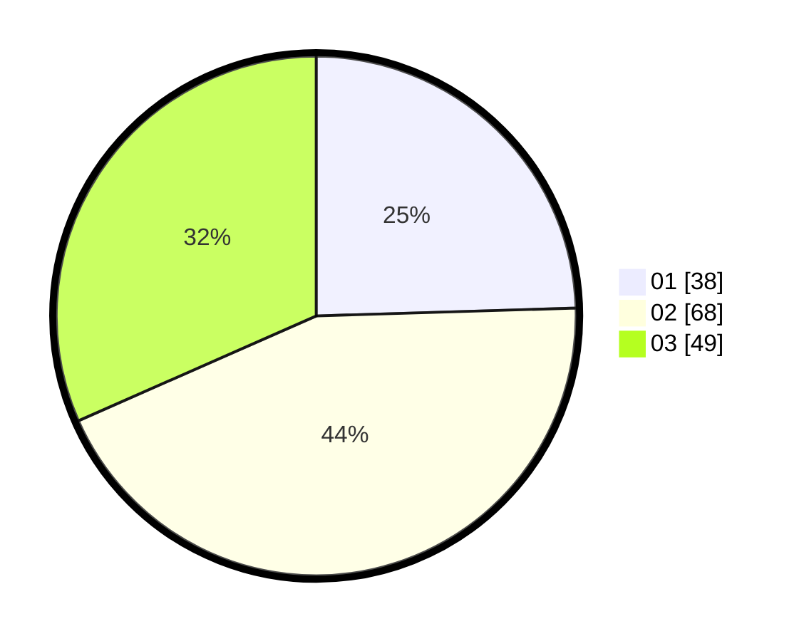

# Hasil

Hasil perolehan suara paslon dapat dilihat pada file paslon-01.txt, paslon-02.txt, dan paslon-03.txt.

Jika tidak ada, artinya data tersebut belum ada pada SIREKAP.

## Perolehan Suara

 * Paslon 01: **38**.
 * Paslon 02: **68**.
 * Paslon 03: **49**.

## Foto C Plano

https://sirekap-obj-formc.kpu.go.id/67bf/pemilu/ppwp/31/71/08/10/04/3171081004036-20240214-230126--9cc9e660-0f5b-4b07-b900-b08387900a0c.jpg

https://sirekap-obj-formc.kpu.go.id/67bf/pemilu/ppwp/31/71/08/10/04/3171081004036-20240214-230438--754937d1-16fb-4f63-bcae-513299bdbfdb.jpg

https://sirekap-obj-formc.kpu.go.id/67bf/pemilu/ppwp/31/71/08/10/04/3171081004036-20240214-230738--19d21479-449e-404c-a6c3-446d8f9e1a34.jpg

## DATA PEMILIH TETAP

Jumlah pemilih dalam DPT: **227**.
 * L: **110**.
 * P: **117**.

## DATA PENGGUNA HAK PILIH

Jumlah pengguna hak pilih dalam DPT: **155**.
 * L: **77**.
 * P: **78**.

Jumlah pengguna hak pilih dalam DPTb: **2**.
 * L: **0**.
 * P: **2**.

Jumlah pengguna hak pilih dalam DPK: **3**.
 * L: **1**.
 * P: **2**.

Jumlah pengguna hak pilih: **160**.
 * L: **78**.
 * P: **82**.

## JUMLAH SUARA SAH DAN TIDAK SAH

JUMLAH SELURUH SUARA SAH: **155**.

JUMLAH SUARA TIDAK SAH: **5**.

JUMLAH SELURUH SUARA SAH DAN SUARA TIDAK SAH: **160**.
