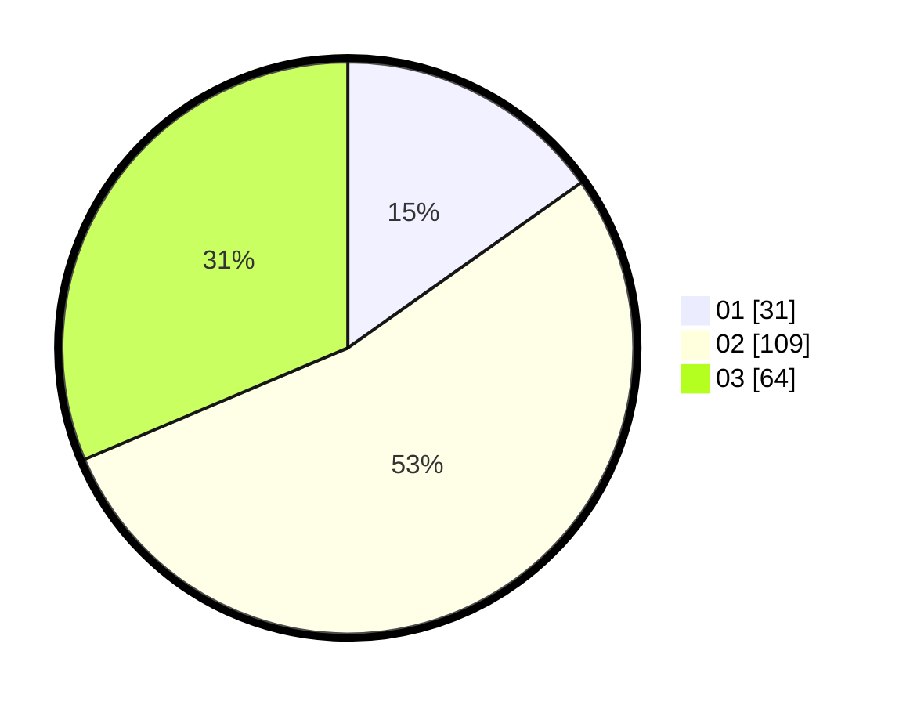

# Hasil

Hasil perolehan suara paslon dapat dilihat pada file paslon-01.txt, paslon-02.txt, dan paslon-03.txt.

Jika tidak ada, artinya data tersebut belum ada pada SIREKAP.

## Perolehan Suara

 * Paslon 01: **31**.
 * Paslon 02: **109**.
 * Paslon 03: **64**.

## Foto C Plano

https://sirekap-obj-formc.kpu.go.id/23a6/pemilu/ppwp/31/71/08/10/04/3171081004039-20240215-204725--8838fd13-743c-445c-a075-70e1585d7118.jpg

https://sirekap-obj-formc.kpu.go.id/23a6/pemilu/ppwp/31/71/08/10/04/3171081004039-20240214-155005--6b0f1bed-7b4c-40d1-90ed-cc4f6e345ef7.jpg

https://sirekap-obj-formc.kpu.go.id/23a6/pemilu/ppwp/31/71/08/10/04/3171081004039-20240214-155304--847fa682-03cf-48de-ac05-65e9526bd7f0.jpg

## DATA PEMILIH TETAP

Jumlah pemilih dalam DPT: **205**.
 * L: **94**.
 * P: **111**.

## DATA PENGGUNA HAK PILIH

Jumlah pengguna hak pilih dalam DPT: **297**.
 * L: **130**.
 * P: **167**.

Jumlah pengguna hak pilih dalam DPTb: **2**.
 * L: **2**.
 * P: **0**.

Jumlah pengguna hak pilih dalam DPK: **2**.
 * L: **1**.
 * P: **1**.

Jumlah pengguna hak pilih: **301**.
 * L: **133**.
 * P: **168**.

## JUMLAH SUARA SAH DAN TIDAK SAH

JUMLAH SELURUH SUARA SAH: **204**.

JUMLAH SUARA TIDAK SAH: **1**.

JUMLAH SELURUH SUARA SAH DAN SUARA TIDAK SAH: **205**.
