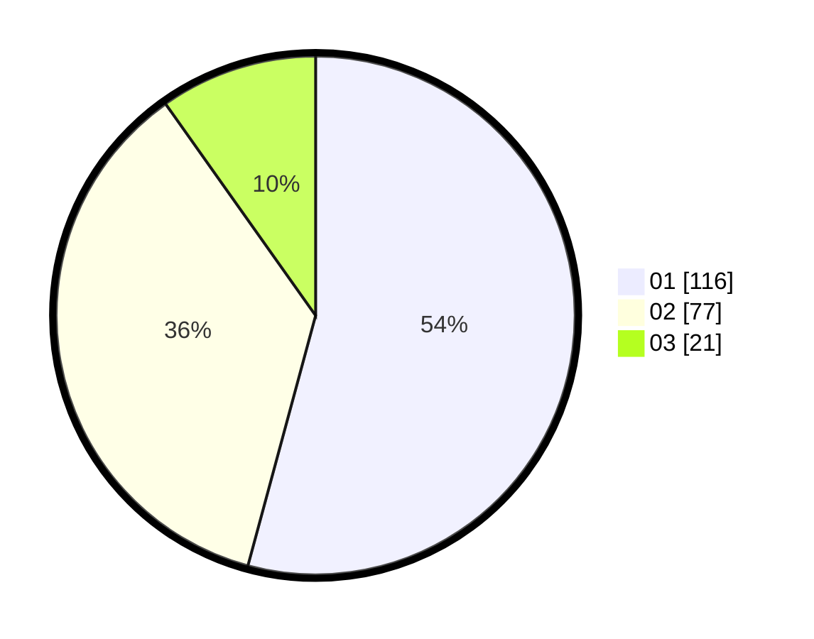

# Hasil

Hasil perolehan suara paslon dapat dilihat pada file paslon-01.txt, paslon-02.txt, dan paslon-03.txt.

Jika tidak ada, artinya data tersebut belum ada pada SIREKAP.

## Perolehan Suara

 * Paslon 01: **116**.
 * Paslon 02: **77**.
 * Paslon 03: **21**.

## Foto C Plano

https://sirekap-obj-formc.kpu.go.id/8797/pemilu/ppwp/31/71/08/10/04/3171081004040-20240215-202645--9241e7eb-1b15-429f-9300-f9fb4aeac6ec.jpg

https://sirekap-obj-formc.kpu.go.id/8797/pemilu/ppwp/31/71/08/10/04/3171081004040-20240216-022658--dabf0d57-cfb2-4587-8a12-637ba9636c29.jpg

https://sirekap-obj-formc.kpu.go.id/8797/pemilu/ppwp/31/71/08/10/04/3171081004040-20240215-202654--112dd93f-c97b-49f5-bef9-a7fc854159ac.jpg

## DATA PEMILIH TETAP

Jumlah pemilih dalam DPT: **257**.
 * L: **134**.
 * P: **123**.

## DATA PENGGUNA HAK PILIH

Jumlah pengguna hak pilih dalam DPT: **257**.
 * L: **134**.
 * P: **123**.

Jumlah pengguna hak pilih dalam DPTb: **0**.
 * L: **0**.
 * P: **0**.

Jumlah pengguna hak pilih dalam DPK: **0**.
 * L: **0**.
 * P: **0**.

Jumlah pengguna hak pilih: **257**.
 * L: **134**.
 * P: **123**.

## JUMLAH SUARA SAH DAN TIDAK SAH

JUMLAH SELURUH SUARA SAH: **214**.

JUMLAH SUARA TIDAK SAH: **0**.

JUMLAH SELURUH SUARA SAH DAN SUARA TIDAK SAH: **214**.
