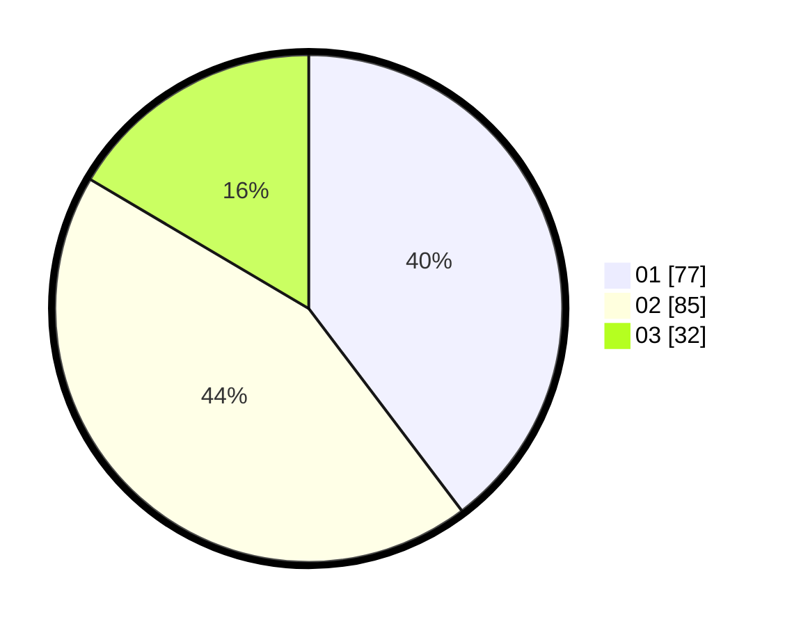

# Hasil

Hasil perolehan suara paslon dapat dilihat pada file paslon-01.txt, paslon-02.txt, dan paslon-03.txt.

Jika tidak ada, artinya data tersebut belum ada pada SIREKAP.

## Perolehan Suara

 * Paslon 01: **77**.
 * Paslon 02: **85**.
 * Paslon 03: **32**.

## Foto C Plano

https://sirekap-obj-formc.kpu.go.id/6d05/pemilu/ppwp/31/71/08/10/04/3171081004043-20240214-193549--3c60bb26-9831-443e-bc57-9b4eac77f4c3.jpg

https://sirekap-obj-formc.kpu.go.id/6d05/pemilu/ppwp/31/71/08/10/04/3171081004043-20240215-025750--452dd501-8ec8-4c7e-b651-b678872b38e0.jpg

https://sirekap-obj-formc.kpu.go.id/6d05/pemilu/ppwp/31/71/08/10/04/3171081004043-20240214-193558--ebf86f79-ae29-4681-8cdc-ffa3a8ec22d8.jpg

## DATA PEMILIH TETAP

Jumlah pemilih dalam DPT: **256**.
 * L: **132**.
 * P: **624**.

## DATA PENGGUNA HAK PILIH

Jumlah pengguna hak pilih dalam DPT: **191**.
 * L: **100**.
 * P: **91**.

Jumlah pengguna hak pilih dalam DPTb: **6**.
 * L: **4**.
 * P: **2**.

Jumlah pengguna hak pilih dalam DPK: **3**.
 * L: **1**.
 * P: **2**.

Jumlah pengguna hak pilih: **200**.
 * L: **105**.
 * P: **95**.

## JUMLAH SUARA SAH DAN TIDAK SAH

JUMLAH SELURUH SUARA SAH: **0**.

JUMLAH SUARA TIDAK SAH: **5**.

JUMLAH SELURUH SUARA SAH DAN SUARA TIDAK SAH: **0**.
