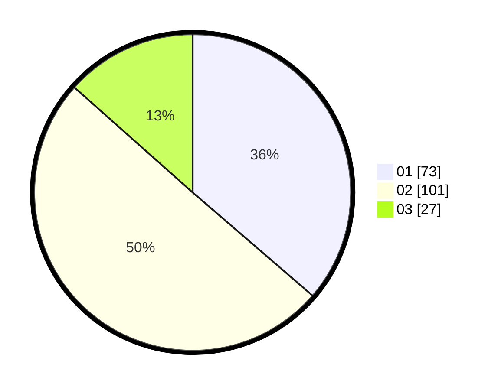

# Hasil

Hasil perolehan suara paslon dapat dilihat pada file paslon-01.txt, paslon-02.txt, dan paslon-03.txt.

Jika tidak ada, artinya data tersebut belum ada pada SIREKAP.

## Perolehan Suara

 * Paslon 01: **73**.
 * Paslon 02: **101**.
 * Paslon 03: **27**.

## Foto C Plano

https://sirekap-obj-formc.kpu.go.id/1296/pemilu/ppwp/31/71/08/10/04/3171081004049-20240216-155920--0ae2e6ef-44e5-47aa-ad38-460adf727178.jpg

https://sirekap-obj-formc.kpu.go.id/1296/pemilu/ppwp/31/71/08/10/04/3171081004049-20240216-155921--b3ebbc77-47f8-4ab7-9546-f34fa4d8534a.jpg

https://sirekap-obj-formc.kpu.go.id/1296/pemilu/ppwp/31/71/08/10/04/3171081004049-20240216-065233--3df0b8fd-0a87-470b-93f5-19981ab6d0ed.jpg

## DATA PEMILIH TETAP

Jumlah pemilih dalam DPT: **282**.
 * L: **142**.
 * P: **140**.

## DATA PENGGUNA HAK PILIH

Jumlah pengguna hak pilih dalam DPT: **203**.
 * L: **102**.
 * P: **101**.

Jumlah pengguna hak pilih dalam DPTb: **1**.
 * L: **0**.
 * P: **1**.

Jumlah pengguna hak pilih dalam DPK: **2**.
 * L: **1**.
 * P: **1**.

Jumlah pengguna hak pilih: **206**.
 * L: **103**.
 * P: **103**.

## JUMLAH SUARA SAH DAN TIDAK SAH

JUMLAH SELURUH SUARA SAH: **201**.

JUMLAH SUARA TIDAK SAH: **5**.

JUMLAH SELURUH SUARA SAH DAN SUARA TIDAK SAH: **206**.
