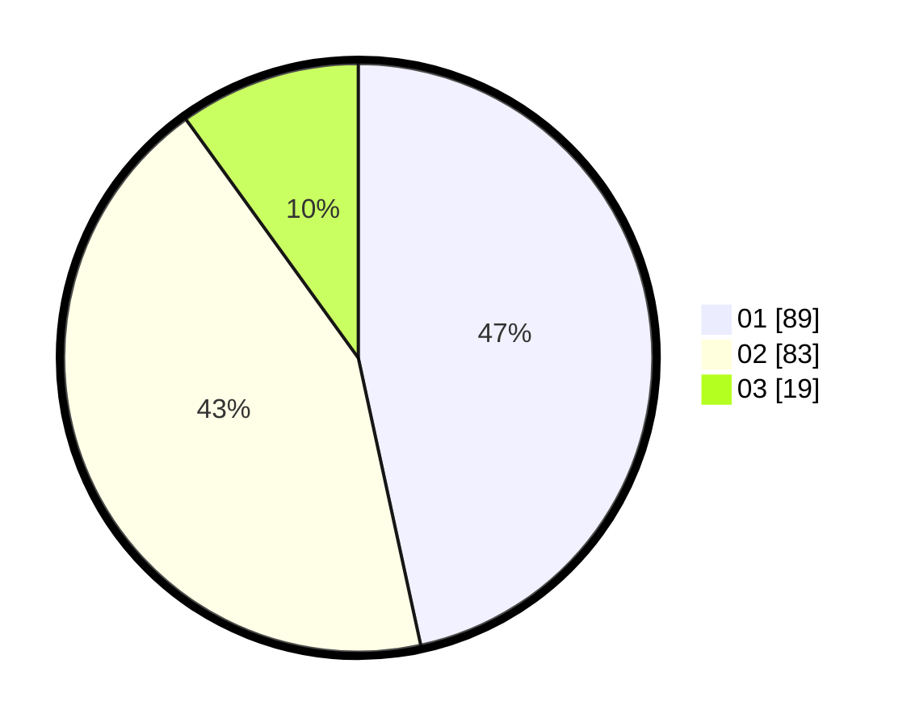

# Hasil

Hasil perolehan suara paslon dapat dilihat pada file paslon-01.txt, paslon-02.txt, dan paslon-03.txt.

Jika tidak ada, artinya data tersebut belum ada pada SIREKAP.

## Perolehan Suara

 * Paslon 01: **89**.
 * Paslon 02: **83**.
 * Paslon 03: **19**.

## Foto C Plano

https://sirekap-obj-formc.kpu.go.id/4292/pemilu/ppwp/31/71/08/10/04/3171081004051-20240214-162214--03274c6f-c2bd-44b2-b29b-a1cb785e9f8b.jpg

https://sirekap-obj-formc.kpu.go.id/4292/pemilu/ppwp/31/71/08/10/04/3171081004051-20240214-191250--80efea96-3f4d-4790-b1ab-ef720419ad64.jpg

https://sirekap-obj-formc.kpu.go.id/4292/pemilu/ppwp/31/71/08/10/04/3171081004051-20240214-190526--323d7c7e-a660-4bff-a280-43aed6cbdf00.jpg

## DATA PEMILIH TETAP

Jumlah pemilih dalam DPT: **261**.
 * L: **140**.
 * P: **121**.

## DATA PENGGUNA HAK PILIH

Jumlah pengguna hak pilih dalam DPT: **191**.
 * L: **103**.
 * P: **88**.

Jumlah pengguna hak pilih dalam DPTb: **2**.
 * L: **1**.
 * P: **1**.

Jumlah pengguna hak pilih dalam DPK: **2**.
 * L: **1**.
 * P: **1**.

Jumlah pengguna hak pilih: **195**.
 * L: **105**.
 * P: **90**.

## JUMLAH SUARA SAH DAN TIDAK SAH

JUMLAH SELURUH SUARA SAH: **191**.

JUMLAH SUARA TIDAK SAH: **4**.

JUMLAH SELURUH SUARA SAH DAN SUARA TIDAK SAH: **195**.
