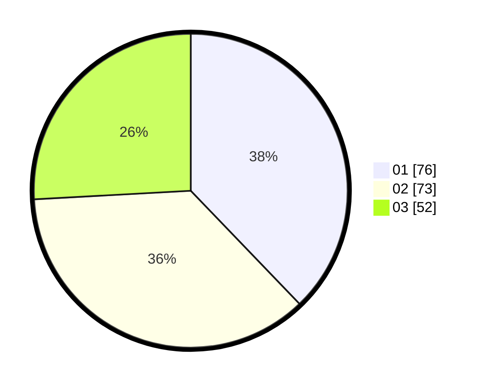

# Hasil

Hasil perolehan suara paslon dapat dilihat pada file paslon-01.txt, paslon-02.txt, dan paslon-03.txt.

Jika tidak ada, artinya data tersebut belum ada pada SIREKAP.

## Perolehan Suara

 * Paslon 01: **76**.
 * Paslon 02: **73**.
 * Paslon 03: **52**.

## Foto C Plano

https://sirekap-obj-formc.kpu.go.id/272f/pemilu/ppwp/31/71/08/10/04/3171081004052-20240215-011608--6d5f2b71-26cc-4e0a-b355-aac8817f440c.jpg

https://sirekap-obj-formc.kpu.go.id/272f/pemilu/ppwp/31/71/08/10/04/3171081004052-20240215-011633--c7da6034-b4fd-41e6-a699-d79bc21d2936.jpg

https://sirekap-obj-formc.kpu.go.id/272f/pemilu/ppwp/31/71/08/10/04/3171081004052-20240215-011656--a2f18531-f98d-4e0b-9a63-8fd8f7fc7d9c.jpg
