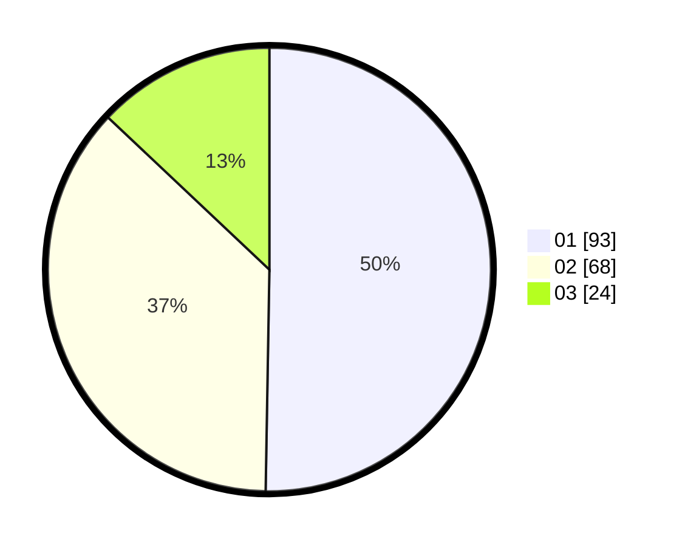

# Hasil

Hasil perolehan suara paslon dapat dilihat pada file paslon-01.txt, paslon-02.txt, dan paslon-03.txt.

Jika tidak ada, artinya data tersebut belum ada pada SIREKAP.

## Perolehan Suara

 * Paslon 01: **93**.
 * Paslon 02: **68**.
 * Paslon 03: **24**.

## Foto C Plano

https://sirekap-obj-formc.kpu.go.id/a3e9/pemilu/ppwp/31/71/08/10/04/3171081004054-20240214-234812--0e3602a9-eadb-42f4-b654-243b06b6bbf2.jpg

https://sirekap-obj-formc.kpu.go.id/a3e9/pemilu/ppwp/31/71/08/10/04/3171081004054-20240214-234920--32602dd8-514d-4957-801f-0c9ab1be5559.jpg

https://sirekap-obj-formc.kpu.go.id/a3e9/pemilu/ppwp/31/71/08/10/04/3171081004054-20240214-235122--2c889ca5-a8f4-402a-b9a4-5e73a4534c11.jpg

## DATA PEMILIH TETAP

Jumlah pemilih dalam DPT: **261**.
 * L: **132**.
 * P: **129**.

## DATA PENGGUNA HAK PILIH

Jumlah pengguna hak pilih dalam DPT: **188**.
 * L: **94**.
 * P: **94**.

Jumlah pengguna hak pilih dalam DPTb: **0**.
 * L: **0**.
 * P: **0**.

Jumlah pengguna hak pilih dalam DPK: **0**.
 * L: **0**.
 * P: **0**.

Jumlah pengguna hak pilih: **188**.
 * L: **94**.
 * P: **94**.

## JUMLAH SUARA SAH DAN TIDAK SAH

JUMLAH SELURUH SUARA SAH: **185**.

JUMLAH SUARA TIDAK SAH: **3**.

JUMLAH SELURUH SUARA SAH DAN SUARA TIDAK SAH: **188**.
