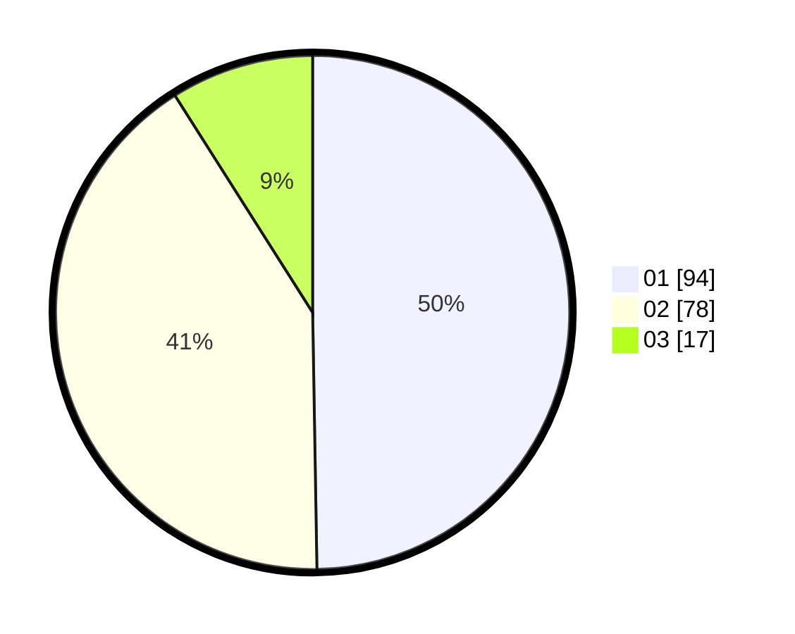

# Hasil

Hasil perolehan suara paslon dapat dilihat pada file paslon-01.txt, paslon-02.txt, dan paslon-03.txt.

Jika tidak ada, artinya data tersebut belum ada pada SIREKAP.

## Perolehan Suara

 * Paslon 01: **94**.
 * Paslon 02: **78**.
 * Paslon 03: **17**.

## Foto C Plano

https://sirekap-obj-formc.kpu.go.id/2590/pemilu/ppwp/31/71/08/10/04/3171081004055-20240214-232646--56d0d409-d861-4f0d-ac0e-633e288efc49.jpg

https://sirekap-obj-formc.kpu.go.id/2590/pemilu/ppwp/31/71/08/10/04/3171081004055-20240214-232825--438f2950-e418-4fe0-a0ed-307c70437383.jpg

https://sirekap-obj-formc.kpu.go.id/2590/pemilu/ppwp/31/71/08/10/04/3171081004055-20240214-232402--4dde7e2a-2dcd-43d2-a10a-846446007f00.jpg

## DATA PEMILIH TETAP

Jumlah pemilih dalam DPT: **244**.
 * L: **126**.
 * P: **118**.

## DATA PENGGUNA HAK PILIH

Jumlah pengguna hak pilih dalam DPT: **192**.
 * L: **99**.
 * P: **93**.

Jumlah pengguna hak pilih dalam DPTb: **1**.
 * L: **0**.
 * P: **1**.

Jumlah pengguna hak pilih dalam DPK: **0**.
 * L: **0**.
 * P: **0**.

Jumlah pengguna hak pilih: **193**.
 * L: **99**.
 * P: **94**.

## JUMLAH SUARA SAH DAN TIDAK SAH

JUMLAH SELURUH SUARA SAH: **189**.

JUMLAH SUARA TIDAK SAH: **4**.

JUMLAH SELURUH SUARA SAH DAN SUARA TIDAK SAH: **193**.
