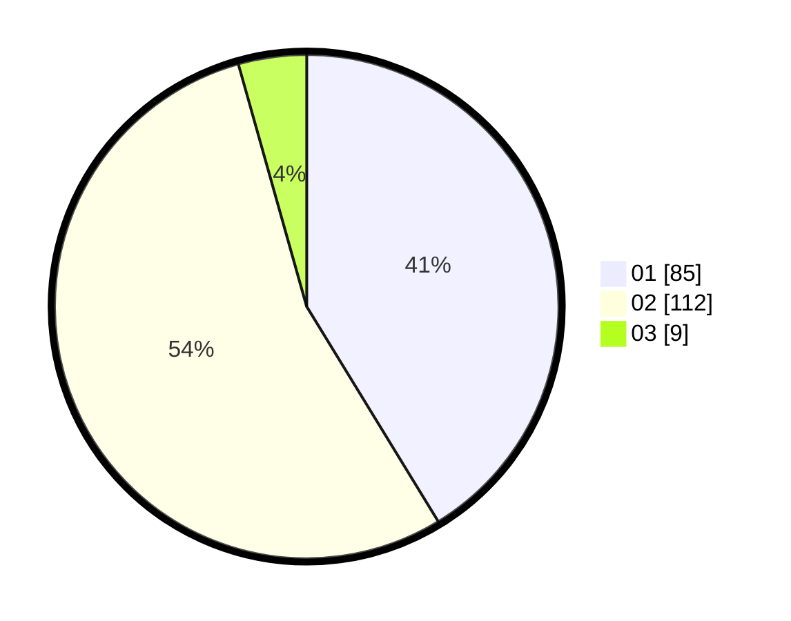

# Hasil

Hasil perolehan suara paslon dapat dilihat pada file paslon-01.txt, paslon-02.txt, dan paslon-03.txt.

Jika tidak ada, artinya data tersebut belum ada pada SIREKAP.

## Perolehan Suara

 * Paslon 01: **85**.
 * Paslon 02: **112**.
 * Paslon 03: **9**.

## Foto C Plano

https://sirekap-obj-formc.kpu.go.id/88db/pemilu/ppwp/31/71/08/10/04/3171081004059-20240214-210704--c4c7aae9-137c-4b50-a7d2-fca15b1f84e0.jpg

https://sirekap-obj-formc.kpu.go.id/88db/pemilu/ppwp/31/71/08/10/04/3171081004059-20240214-210725--eb664b96-5ff3-4f87-9dd8-6fa003d58afa.jpg

https://sirekap-obj-formc.kpu.go.id/88db/pemilu/ppwp/31/71/08/10/04/3171081004059-20240214-210744--a005ef0a-ab3e-424f-a071-bda68d8b82b3.jpg

## DATA PEMILIH TETAP

Jumlah pemilih dalam DPT: **282**.
 * L: **132**.
 * P: **150**.

## DATA PENGGUNA HAK PILIH

Jumlah pengguna hak pilih dalam DPT: **204**.
 * L: **95**.
 * P: **109**.

Jumlah pengguna hak pilih dalam DPTb: **0**.
 * L: **0**.
 * P: **0**.

Jumlah pengguna hak pilih dalam DPK: **6**.
 * L: **2**.
 * P: **4**.

Jumlah pengguna hak pilih: **210**.
 * L: **97**.
 * P: **113**.

## JUMLAH SUARA SAH DAN TIDAK SAH

JUMLAH SELURUH SUARA SAH: **206**.

JUMLAH SUARA TIDAK SAH: **4**.

JUMLAH SELURUH SUARA SAH DAN SUARA TIDAK SAH: **210**.
