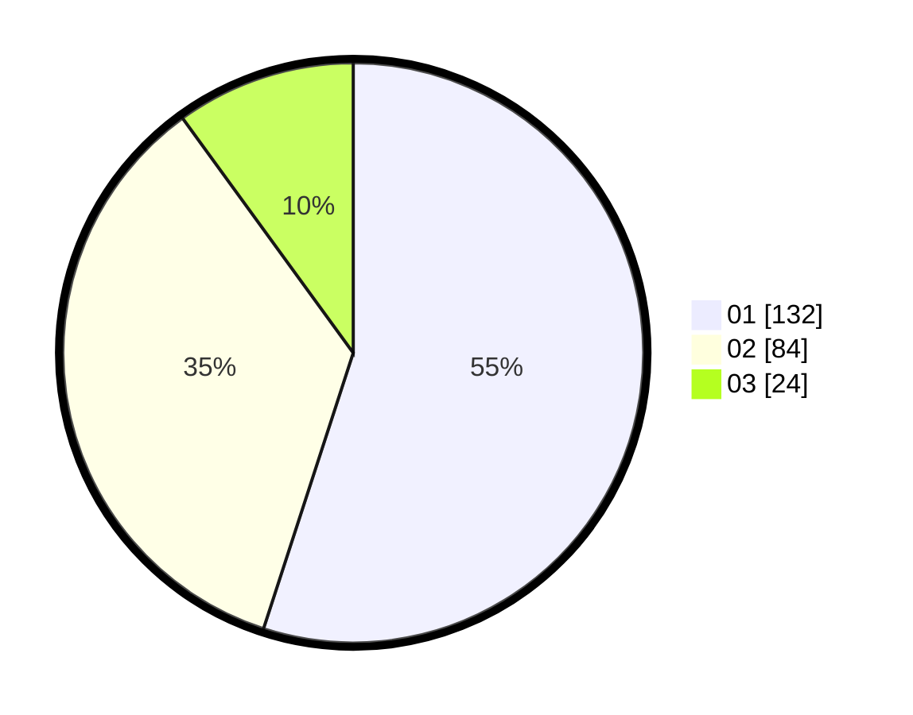

# Hasil

Hasil perolehan suara paslon dapat dilihat pada file paslon-01.txt, paslon-02.txt, dan paslon-03.txt.

Jika tidak ada, artinya data tersebut belum ada pada SIREKAP.

## Perolehan Suara

 * Paslon 01: **132**.
 * Paslon 02: **84**.
 * Paslon 03: **24**.

## Foto C Plano

https://sirekap-obj-formc.kpu.go.id/97bd/pemilu/ppwp/31/71/08/10/04/3171081004061-20240215-011547--86009cc5-ecf6-4ac8-83f6-21eb0282ea22.jpg

https://sirekap-obj-formc.kpu.go.id/97bd/pemilu/ppwp/31/71/08/10/04/3171081004061-20240215-013626--a4257c3b-1296-4f2b-b146-bcd33e2150e0.jpg

https://sirekap-obj-formc.kpu.go.id/97bd/pemilu/ppwp/31/71/08/10/04/3171081004061-20240215-014547--9aa242ee-f8c1-4200-aabd-52d05a41fd8e.jpg

## DATA PEMILIH TETAP

Jumlah pemilih dalam DPT: **282**.
 * L: **141**.
 * P: **141**.

## DATA PENGGUNA HAK PILIH

Jumlah pengguna hak pilih dalam DPT: **242**.
 * L: **117**.
 * P: **125**.

Jumlah pengguna hak pilih dalam DPTb: **1**.
 * L: **1**.
 * P: **0**.

Jumlah pengguna hak pilih dalam DPK: **3**.
 * L: **2**.
 * P: **1**.

Jumlah pengguna hak pilih: **246**.
 * L: **120**.
 * P: **126**.

## JUMLAH SUARA SAH DAN TIDAK SAH

JUMLAH SELURUH SUARA SAH: **240**.

JUMLAH SUARA TIDAK SAH: **6**.

JUMLAH SELURUH SUARA SAH DAN SUARA TIDAK SAH: **246**.
