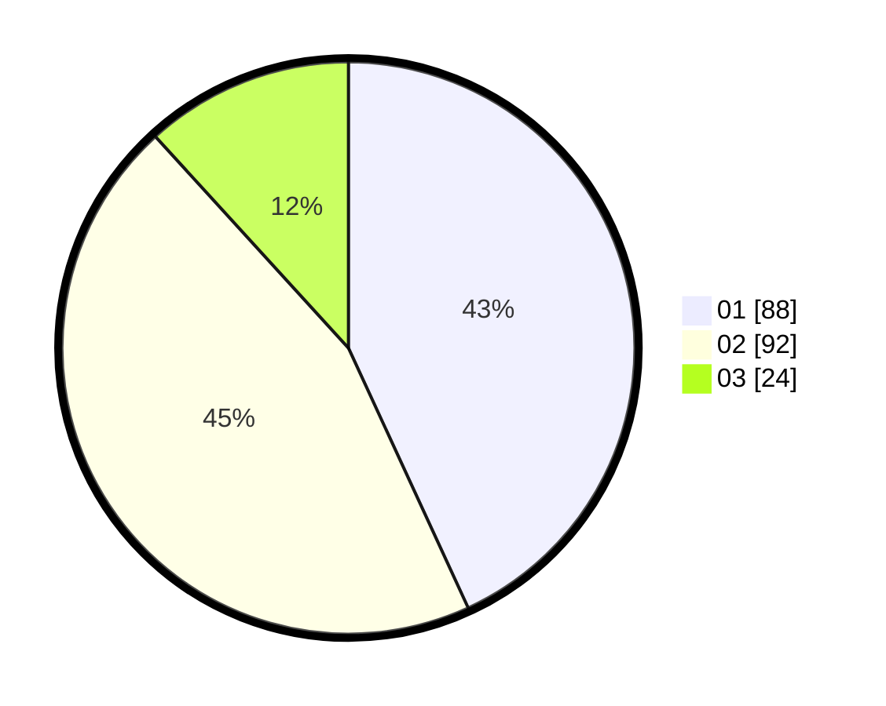

# Hasil

Hasil perolehan suara paslon dapat dilihat pada file paslon-01.txt, paslon-02.txt, dan paslon-03.txt.

Jika tidak ada, artinya data tersebut belum ada pada SIREKAP.

## Perolehan Suara

 * Paslon 01: **88**.
 * Paslon 02: **92**.
 * Paslon 03: **24**.

## Foto C Plano

https://sirekap-obj-formc.kpu.go.id/088c/pemilu/ppwp/31/71/08/10/04/3171081004068-20240214-155105--c4752a4e-8ace-46f9-b814-cc330ec179d0.jpg

https://sirekap-obj-formc.kpu.go.id/088c/pemilu/ppwp/31/71/08/10/04/3171081004068-20240214-155901--3cff9af6-fd60-4a61-a323-fa0c1b5076ff.jpg

https://sirekap-obj-formc.kpu.go.id/088c/pemilu/ppwp/31/71/08/10/04/3171081004068-20240214-155109--a9afccd4-2f73-4492-812c-781b849a3adb.jpg

## DATA PEMILIH TETAP

Jumlah pemilih dalam DPT: **254**.
 * L: **128**.
 * P: **126**.

## DATA PENGGUNA HAK PILIH

Jumlah pengguna hak pilih dalam DPT: **207**.
 * L: **102**.
 * P: **105**.

Jumlah pengguna hak pilih dalam DPTb: **0**.
 * L: **0**.
 * P: **0**.

Jumlah pengguna hak pilih dalam DPK: **1**.
 * L: **0**.
 * P: **1**.

Jumlah pengguna hak pilih: **208**.
 * L: **102**.
 * P: **106**.

## JUMLAH SUARA SAH DAN TIDAK SAH

JUMLAH SELURUH SUARA SAH: **204**.

JUMLAH SUARA TIDAK SAH: **4**.

JUMLAH SELURUH SUARA SAH DAN SUARA TIDAK SAH: **208**.
