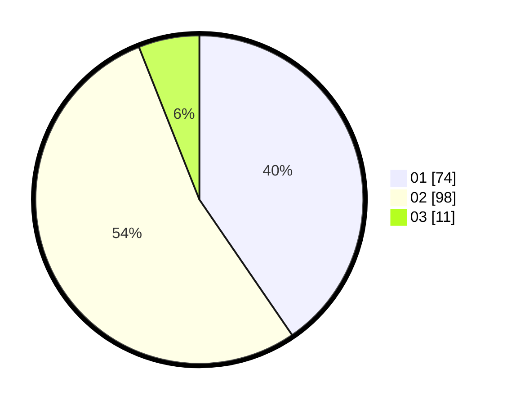

# Hasil

Hasil perolehan suara paslon dapat dilihat pada file paslon-01.txt, paslon-02.txt, dan paslon-03.txt.

Jika tidak ada, artinya data tersebut belum ada pada SIREKAP.

## Perolehan Suara

 * Paslon 01: **74**.
 * Paslon 02: **98**.
 * Paslon 03: **11**.

## Foto C Plano

https://sirekap-obj-formc.kpu.go.id/d426/pemilu/ppwp/31/71/08/10/04/3171081004073-20240216-154934--3d1d4953-91d3-441f-8944-3b13e50a3edf.jpg

https://sirekap-obj-formc.kpu.go.id/d426/pemilu/ppwp/31/71/08/10/04/3171081004073-20240216-154936--5c7cfef3-2b43-4412-9e4d-26b840836e41.jpg

https://sirekap-obj-formc.kpu.go.id/d426/pemilu/ppwp/31/71/08/10/04/3171081004073-20240216-154935--eae6b55f-39c5-46c7-8626-697f023a5c31.jpg

## DATA PEMILIH TETAP

Jumlah pemilih dalam DPT: **262**.
 * L: **132**.
 * P: **130**.

## DATA PENGGUNA HAK PILIH

Jumlah pengguna hak pilih dalam DPT: **180**.
 * L: **86**.
 * P: **94**.

Jumlah pengguna hak pilih dalam DPTb: **1**.
 * L: **1**.
 * P: **0**.

Jumlah pengguna hak pilih dalam DPK: **3**.
 * L: **2**.
 * P: **1**.

Jumlah pengguna hak pilih: **184**.
 * L: **89**.
 * P: **95**.

## JUMLAH SUARA SAH DAN TIDAK SAH

JUMLAH SELURUH SUARA SAH: **183**.

JUMLAH SUARA TIDAK SAH: **1**.

JUMLAH SELURUH SUARA SAH DAN SUARA TIDAK SAH: **184**.
