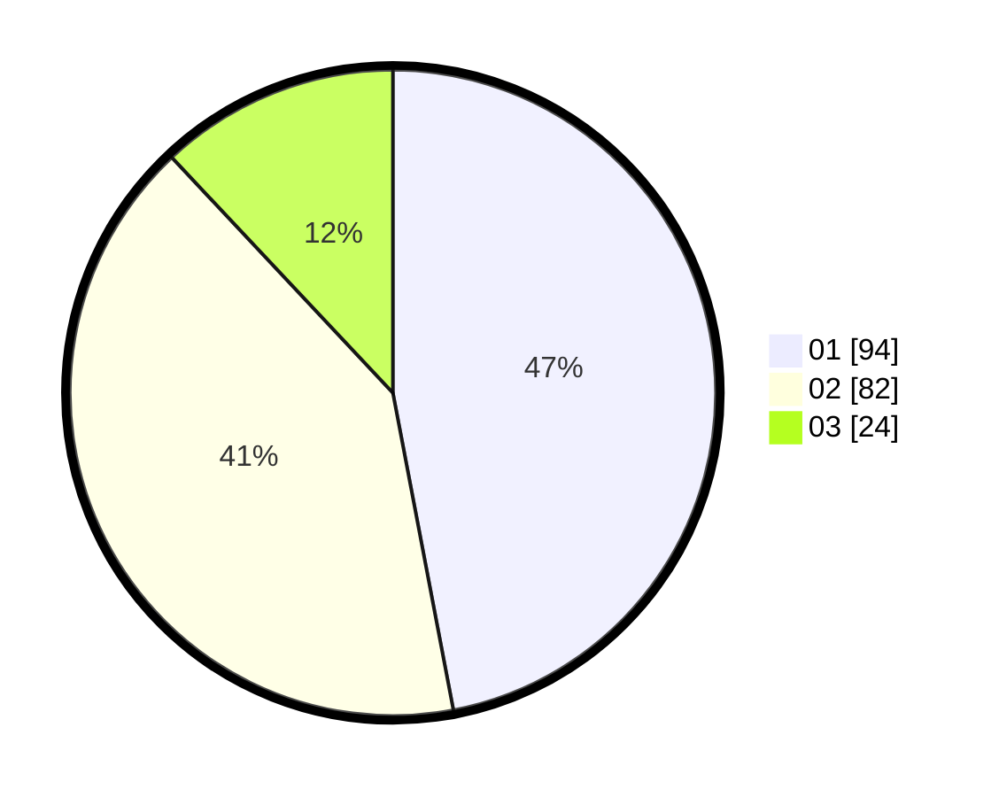

# Hasil

Hasil perolehan suara paslon dapat dilihat pada file paslon-01.txt, paslon-02.txt, dan paslon-03.txt.

Jika tidak ada, artinya data tersebut belum ada pada SIREKAP.

## Perolehan Suara

 * Paslon 01: **94**.
 * Paslon 02: **82**.
 * Paslon 03: **24**.

## Foto C Plano

https://sirekap-obj-formc.kpu.go.id/3547/pemilu/ppwp/31/71/08/10/04/3171081004074-20240214-222040--9471b8a3-c07d-4e80-a075-49faaecdb0f7.jpg

https://sirekap-obj-formc.kpu.go.id/3547/pemilu/ppwp/31/71/08/10/04/3171081004074-20240214-222328--aead1473-8ab1-4cbc-8ba1-048e692de30b.jpg

https://sirekap-obj-formc.kpu.go.id/3547/pemilu/ppwp/31/71/08/10/04/3171081004074-20240214-222505--4c1723f1-d068-46c4-81f2-3d39cbd4b7bb.jpg

## DATA PEMILIH TETAP

Jumlah pemilih dalam DPT: **265**.
 * L: **131**.
 * P: **134**.

## DATA PENGGUNA HAK PILIH

Jumlah pengguna hak pilih dalam DPT: **207**.
 * L: **101**.
 * P: **106**.

Jumlah pengguna hak pilih dalam DPTb: **1**.
 * L: **0**.
 * P: **1**.

Jumlah pengguna hak pilih dalam DPK: **1**.
 * L: **1**.
 * P: **0**.

Jumlah pengguna hak pilih: **209**.
 * L: **102**.
 * P: **107**.

## JUMLAH SUARA SAH DAN TIDAK SAH

JUMLAH SELURUH SUARA SAH: **205**.

JUMLAH SUARA TIDAK SAH: **4**.

JUMLAH SELURUH SUARA SAH DAN SUARA TIDAK SAH: **209**.
