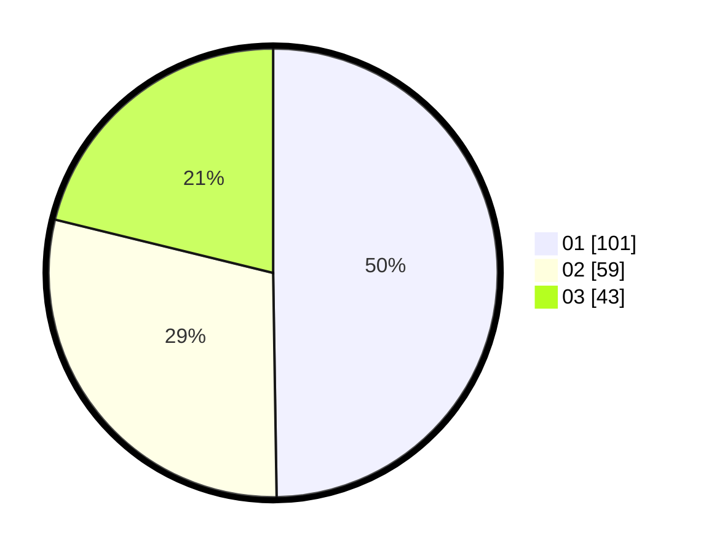

# Hasil

Hasil perolehan suara paslon dapat dilihat pada file paslon-01.txt, paslon-02.txt, dan paslon-03.txt.

Jika tidak ada, artinya data tersebut belum ada pada SIREKAP.

## Perolehan Suara

 * Paslon 01: **101**.
 * Paslon 02: **59**.
 * Paslon 03: **43**.

## Foto C Plano

https://sirekap-obj-formc.kpu.go.id/2a95/pemilu/ppwp/31/71/08/10/04/3171081004076-20240215-185328--48ddf54f-e795-4f9e-97f3-726e171fef32.jpg

https://sirekap-obj-formc.kpu.go.id/2a95/pemilu/ppwp/31/71/08/10/04/3171081004076-20240215-185331--d3f25062-facc-407d-aef5-0c71952ac20f.jpg

https://sirekap-obj-formc.kpu.go.id/2a95/pemilu/ppwp/31/71/08/10/04/3171081004076-20240215-185336--13d43306-4dd1-422f-be90-77d877e6b472.jpg

## DATA PEMILIH TETAP

Jumlah pemilih dalam DPT: **269**.
 * L: **131**.
 * P: **138**.

## DATA PENGGUNA HAK PILIH

Jumlah pengguna hak pilih dalam DPT: **194**.
 * L: **87**.
 * P: **107**.

Jumlah pengguna hak pilih dalam DPTb: **3**.
 * L: **2**.
 * P: **1**.

Jumlah pengguna hak pilih dalam DPK: **7**.
 * L: **3**.
 * P: **4**.

Jumlah pengguna hak pilih: **204**.
 * L: **92**.
 * P: **112**.

## JUMLAH SUARA SAH DAN TIDAK SAH

JUMLAH SELURUH SUARA SAH: **203**.

JUMLAH SUARA TIDAK SAH: **1**.

JUMLAH SELURUH SUARA SAH DAN SUARA TIDAK SAH: **204**.
