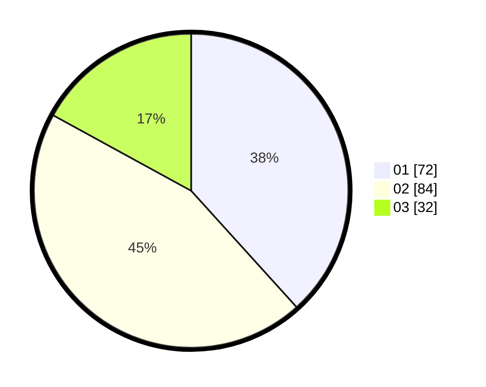

# Hasil

Hasil perolehan suara paslon dapat dilihat pada file paslon-01.txt, paslon-02.txt, dan paslon-03.txt.

Jika tidak ada, artinya data tersebut belum ada pada SIREKAP.

## Perolehan Suara

 * Paslon 01: **72**.
 * Paslon 02: **84**.
 * Paslon 03: **32**.

## Foto C Plano

https://sirekap-obj-formc.kpu.go.id/dc00/pemilu/ppwp/31/71/08/10/04/3171081004078-20240214-192142--4d7c8612-2009-4bd8-84ee-17f327f71184.jpg

https://sirekap-obj-formc.kpu.go.id/dc00/pemilu/ppwp/31/71/08/10/04/3171081004078-20240214-192030--57905b61-9189-4335-b97c-df58f949bb18.jpg

https://sirekap-obj-formc.kpu.go.id/dc00/pemilu/ppwp/31/71/08/10/04/3171081004078-20240216-163201--7b6125b1-f843-4154-92e5-9a456b6ba803.jpg

## DATA PEMILIH TETAP

Jumlah pemilih dalam DPT: **273**.
 * L: **146**.
 * P: **127**.

## DATA PENGGUNA HAK PILIH

Jumlah pengguna hak pilih dalam DPT: **186**.
 * L: **102**.
 * P: **84**.

Jumlah pengguna hak pilih dalam DPTb: **1**.
 * L: **0**.
 * P: **1**.

Jumlah pengguna hak pilih dalam DPK: **3**.
 * L: **2**.
 * P: **1**.

Jumlah pengguna hak pilih: **190**.
 * L: **104**.
 * P: **86**.

## JUMLAH SUARA SAH DAN TIDAK SAH

JUMLAH SELURUH SUARA SAH: **188**.

JUMLAH SUARA TIDAK SAH: **2**.

JUMLAH SELURUH SUARA SAH DAN SUARA TIDAK SAH: **190**.
