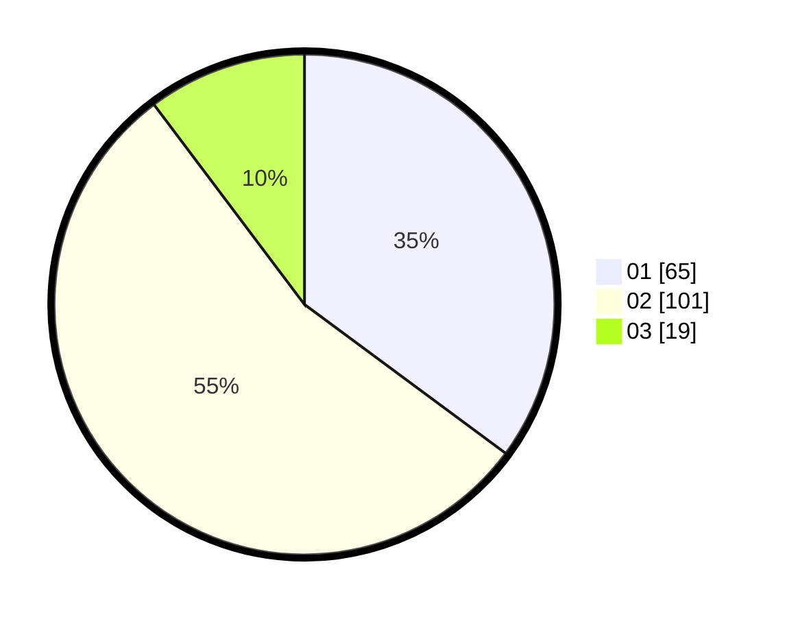

# Hasil

Hasil perolehan suara paslon dapat dilihat pada file paslon-01.txt, paslon-02.txt, dan paslon-03.txt.

Jika tidak ada, artinya data tersebut belum ada pada SIREKAP.

## Perolehan Suara

 * Paslon 01: **65**.
 * Paslon 02: **101**.
 * Paslon 03: **19**.

## Foto C Plano

https://sirekap-obj-formc.kpu.go.id/2326/pemilu/ppwp/31/71/08/10/04/3171081004085-20240216-151533--fb8fc265-866b-4d11-8e4d-bb151084c6a6.jpg

https://sirekap-obj-formc.kpu.go.id/2326/pemilu/ppwp/31/71/08/10/04/3171081004085-20240216-151534--120d9afc-d34a-40c9-beeb-69628a267909.jpg

https://sirekap-obj-formc.kpu.go.id/2326/pemilu/ppwp/31/71/08/10/04/3171081004085-20240216-151533--7d41dcf7-2ce7-4b46-8116-eadfc21c6e01.jpg

## DATA PEMILIH TETAP

Jumlah pemilih dalam DPT: **253**.
 * L: **131**.
 * P: **122**.

## DATA PENGGUNA HAK PILIH

Jumlah pengguna hak pilih dalam DPT: **231**.
 * L: **118**.
 * P: **113**.

Jumlah pengguna hak pilih dalam DPTb: **0**.
 * L: **0**.
 * P: **0**.

Jumlah pengguna hak pilih dalam DPK: **2**.
 * L: **1**.
 * P: **1**.

Jumlah pengguna hak pilih: **233**.
 * L: **119**.
 * P: **114**.

## JUMLAH SUARA SAH DAN TIDAK SAH

JUMLAH SELURUH SUARA SAH: **185**.

JUMLAH SUARA TIDAK SAH: **9**.

JUMLAH SELURUH SUARA SAH DAN SUARA TIDAK SAH: **194**.
