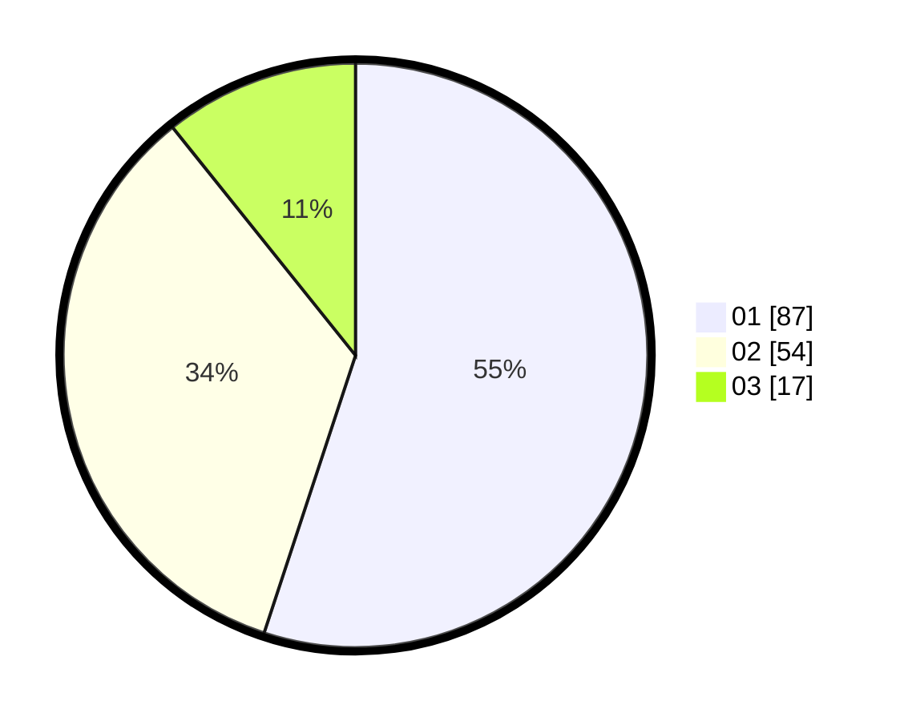

# Hasil

Hasil perolehan suara paslon dapat dilihat pada file paslon-01.txt, paslon-02.txt, dan paslon-03.txt.

Jika tidak ada, artinya data tersebut belum ada pada SIREKAP.

## Perolehan Suara

 * Paslon 01: **87**.
 * Paslon 02: **54**.
 * Paslon 03: **17**.

## Foto C Plano

https://sirekap-obj-formc.kpu.go.id/f54f/pemilu/ppwp/31/71/08/10/04/3171081004090-20240216-152835--4aeb8f03-c356-433c-92f5-89ee186bc7ae.jpg

https://sirekap-obj-formc.kpu.go.id/f54f/pemilu/ppwp/31/71/08/10/04/3171081004090-20240216-152837--62518715-010e-49f6-9238-ba8e370a0866.jpg

https://sirekap-obj-formc.kpu.go.id/f54f/pemilu/ppwp/31/71/08/10/04/3171081004090-20240216-152836--cb4bb7f5-600f-43a1-8004-44aff0dfc821.jpg

## DATA PEMILIH TETAP

Jumlah pemilih dalam DPT: **249**.
 * L: **132**.
 * P: **117**.

## DATA PENGGUNA HAK PILIH

Jumlah pengguna hak pilih dalam DPT: **163**.
 * L: **84**.
 * P: **79**.

Jumlah pengguna hak pilih dalam DPTb: **0**.
 * L: **0**.
 * P: **0**.

Jumlah pengguna hak pilih dalam DPK: **1**.
 * L: **1**.
 * P: **0**.

Jumlah pengguna hak pilih: **164**.
 * L: **85**.
 * P: **79**.

## JUMLAH SUARA SAH DAN TIDAK SAH

JUMLAH SELURUH SUARA SAH: **158**.

JUMLAH SUARA TIDAK SAH: **6**.

JUMLAH SELURUH SUARA SAH DAN SUARA TIDAK SAH: **164**.
