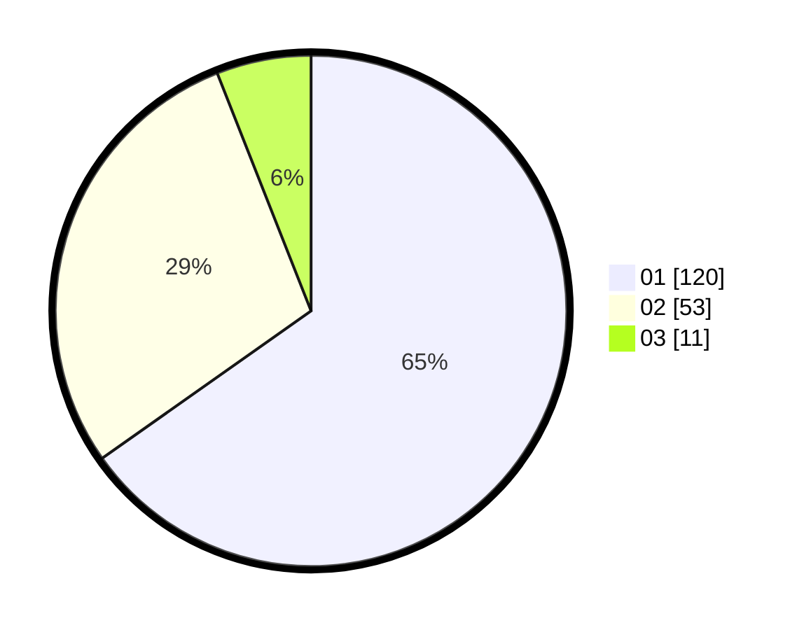

# Hasil

Hasil perolehan suara paslon dapat dilihat pada file paslon-01.txt, paslon-02.txt, dan paslon-03.txt.

Jika tidak ada, artinya data tersebut belum ada pada SIREKAP.

## Perolehan Suara

 * Paslon 01: **120**.
 * Paslon 02: **53**.
 * Paslon 03: **11**.

## Foto C Plano

https://sirekap-obj-formc.kpu.go.id/b2d5/pemilu/ppwp/31/71/08/10/04/3171081004093-20240215-010348--be600e70-fecf-4a36-9057-3961f71e7893.jpg

https://sirekap-obj-formc.kpu.go.id/b2d5/pemilu/ppwp/31/71/08/10/04/3171081004093-20240215-010434--a3a1e3f0-c26b-4cb4-981c-56773bca441f.jpg

https://sirekap-obj-formc.kpu.go.id/b2d5/pemilu/ppwp/31/71/08/10/04/3171081004093-20240215-010511--3af858ea-d1ac-4a6a-86e5-c3a717b66fa7.jpg

## DATA PEMILIH TETAP

Jumlah pemilih dalam DPT: **235**.
 * L: **119**.
 * P: **116**.

## DATA PENGGUNA HAK PILIH

Jumlah pengguna hak pilih dalam DPT: **235**.
 * L: **119**.
 * P: **116**.

Jumlah pengguna hak pilih dalam DPTb: **0**.
 * L: **0**.
 * P: **0**.

Jumlah pengguna hak pilih dalam DPK: **0**.
 * L: **0**.
 * P: **0**.

Jumlah pengguna hak pilih: **235**.
 * L: **119**.
 * P: **116**.

## JUMLAH SUARA SAH DAN TIDAK SAH

JUMLAH SELURUH SUARA SAH: **184**.

JUMLAH SUARA TIDAK SAH: **6**.

JUMLAH SELURUH SUARA SAH DAN SUARA TIDAK SAH: **190**.
