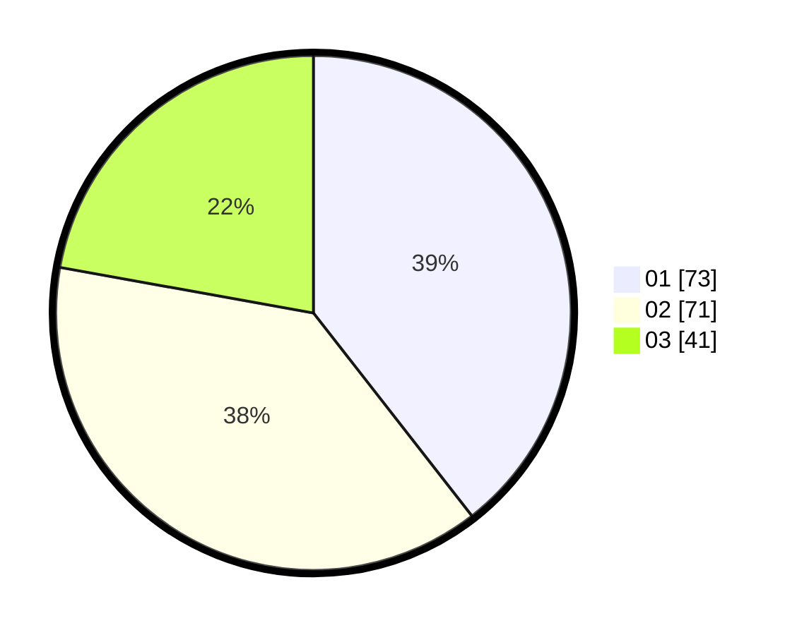

# Hasil

Hasil perolehan suara paslon dapat dilihat pada file paslon-01.txt, paslon-02.txt, dan paslon-03.txt.

Jika tidak ada, artinya data tersebut belum ada pada SIREKAP.

## Perolehan Suara

 * Paslon 01: **73**.
 * Paslon 02: **71**.
 * Paslon 03: **41**.

## Foto C Plano

https://sirekap-obj-formc.kpu.go.id/1ea3/pemilu/ppwp/31/71/08/10/04/3171081004099-20240214-191844--0d047c29-3e4c-4839-bb17-c74f32c5111e.jpg

https://sirekap-obj-formc.kpu.go.id/1ea3/pemilu/ppwp/31/71/08/10/04/3171081004099-20240214-192932--60f55039-1c8d-42a0-a037-7f53df92850c.jpg

https://sirekap-obj-formc.kpu.go.id/1ea3/pemilu/ppwp/31/71/08/10/04/3171081004099-20240214-190800--afd15380-58d5-46fa-b677-60a3454d164f.jpg

## DATA PEMILIH TETAP

Jumlah pemilih dalam DPT: **246**.
 * L: **120**.
 * P: **126**.

## DATA PENGGUNA HAK PILIH

Jumlah pengguna hak pilih dalam DPT: **187**.
 * L: **88**.
 * P: **99**.

Jumlah pengguna hak pilih dalam DPTb: **1**.
 * L: **0**.
 * P: **1**.

Jumlah pengguna hak pilih dalam DPK: **1**.
 * L: **1**.
 * P: **0**.

Jumlah pengguna hak pilih: **189**.
 * L: **89**.
 * P: **100**.

## JUMLAH SUARA SAH DAN TIDAK SAH

JUMLAH SELURUH SUARA SAH: **185**.

JUMLAH SUARA TIDAK SAH: **4**.

JUMLAH SELURUH SUARA SAH DAN SUARA TIDAK SAH: **189**.
