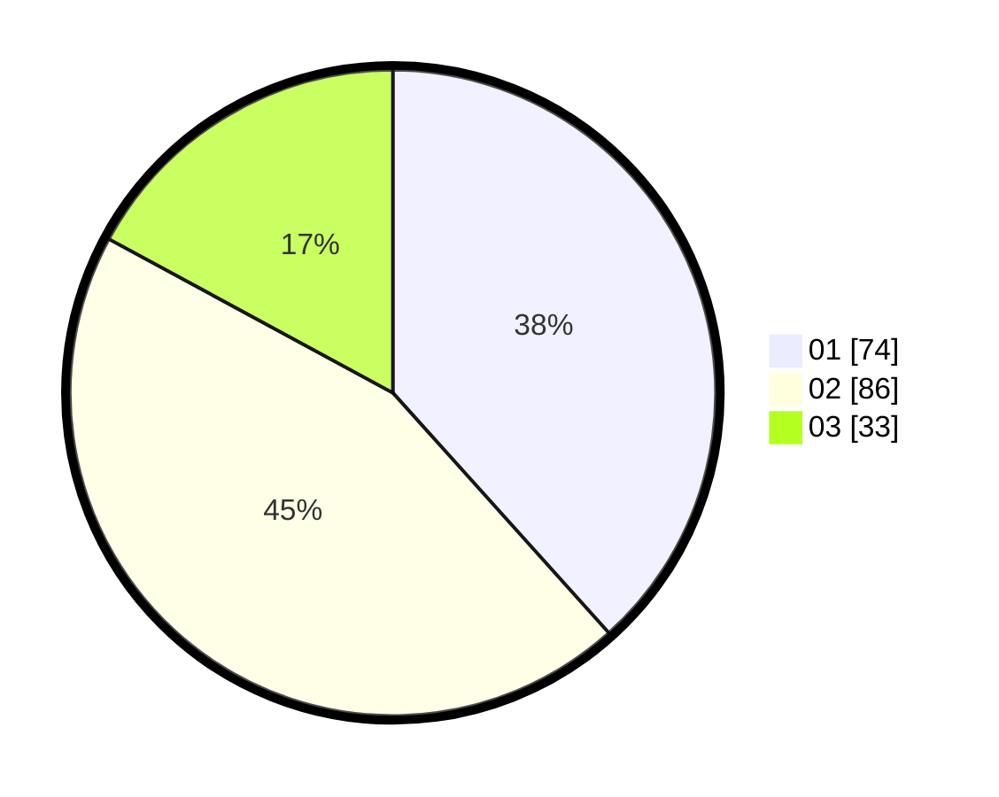

# Hasil

Hasil perolehan suara paslon dapat dilihat pada file paslon-01.txt, paslon-02.txt, dan paslon-03.txt.

Jika tidak ada, artinya data tersebut belum ada pada SIREKAP.

## Perolehan Suara

 * Paslon 01: **74**.
 * Paslon 02: **86**.
 * Paslon 03: **33**.

## Foto C Plano

https://sirekap-obj-formc.kpu.go.id/20e6/pemilu/ppwp/31/71/08/10/04/3171081004101-20240214-232219--0bf87ff5-4ca8-4ef2-a657-192002576963.jpg

https://sirekap-obj-formc.kpu.go.id/20e6/pemilu/ppwp/31/71/08/10/04/3171081004101-20240214-232550--ea9eccec-6c4e-45e4-a274-1ea6017c1aca.jpg

https://sirekap-obj-formc.kpu.go.id/20e6/pemilu/ppwp/31/71/08/10/04/3171081004101-20240214-232813--52856e91-7fa2-4866-b803-48434600fe1a.jpg

## DATA PEMILIH TETAP

Jumlah pemilih dalam DPT: **242**.
 * L: **123**.
 * P: **119**.

## DATA PENGGUNA HAK PILIH

Jumlah pengguna hak pilih dalam DPT: **196**.
 * L: **94**.
 * P: **102**.

Jumlah pengguna hak pilih dalam DPTb: **0**.
 * L: **0**.
 * P: **0**.

Jumlah pengguna hak pilih dalam DPK: **0**.
 * L: **0**.
 * P: **0**.

Jumlah pengguna hak pilih: **196**.
 * L: **94**.
 * P: **102**.

## JUMLAH SUARA SAH DAN TIDAK SAH

JUMLAH SELURUH SUARA SAH: **193**.

JUMLAH SUARA TIDAK SAH: **3**.

JUMLAH SELURUH SUARA SAH DAN SUARA TIDAK SAH: **196**.
