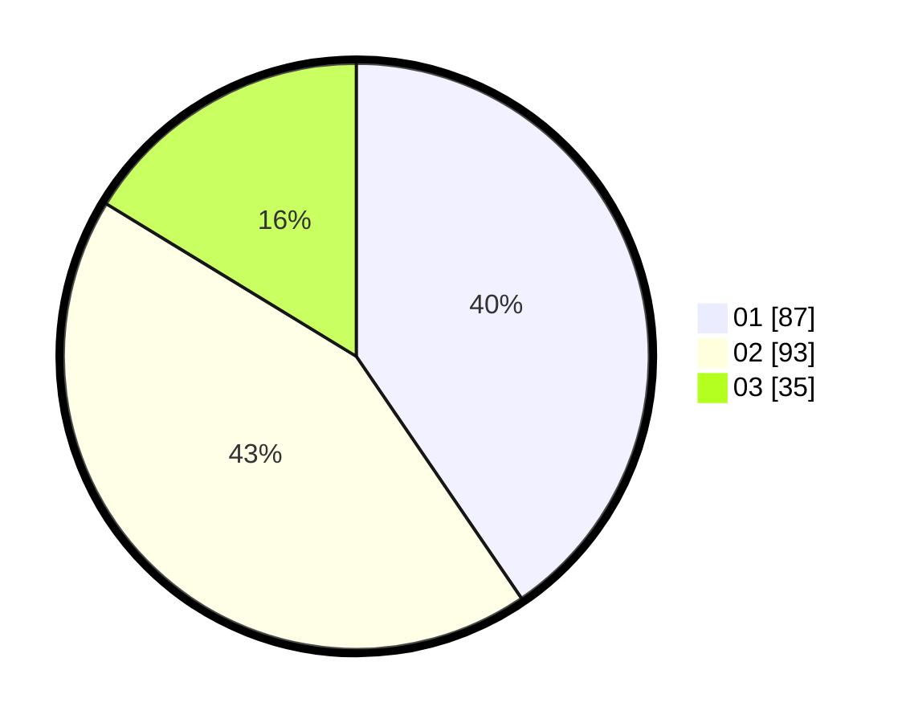

# Hasil

Hasil perolehan suara paslon dapat dilihat pada file paslon-01.txt, paslon-02.txt, dan paslon-03.txt.

Jika tidak ada, artinya data tersebut belum ada pada SIREKAP.

## Perolehan Suara

 * Paslon 01: **87**.
 * Paslon 02: **93**.
 * Paslon 03: **35**.

## Foto C Plano

https://sirekap-obj-formc.kpu.go.id/62e3/pemilu/ppwp/31/71/08/10/04/3171081004103-20240217-210805--d35afcb8-a867-4a2f-9d17-223201a1f08b.jpg

https://sirekap-obj-formc.kpu.go.id/62e3/pemilu/ppwp/31/71/08/10/04/3171081004103-20240217-211334--188ad5ee-594a-4d17-9131-2b9b420abf53.jpg

https://sirekap-obj-formc.kpu.go.id/62e3/pemilu/ppwp/31/71/08/10/04/3171081004103-20240217-210750--7a6fcdd4-e4ef-4e7f-b61d-5b2b3af50288.jpg

## DATA PEMILIH TETAP

Jumlah pemilih dalam DPT: **281**.
 * L: **144**.
 * P: **137**.

## DATA PENGGUNA HAK PILIH

Jumlah pengguna hak pilih dalam DPT: **214**.
 * L: **104**.
 * P: **110**.

Jumlah pengguna hak pilih dalam DPTb: **0**.
 * L: **0**.
 * P: **0**.

Jumlah pengguna hak pilih dalam DPK: **2**.
 * L: **1**.
 * P: **1**.

Jumlah pengguna hak pilih: **216**.
 * L: **105**.
 * P: **111**.

## JUMLAH SUARA SAH DAN TIDAK SAH

JUMLAH SELURUH SUARA SAH: **215**.

JUMLAH SUARA TIDAK SAH: **1**.

JUMLAH SELURUH SUARA SAH DAN SUARA TIDAK SAH: **216**.
