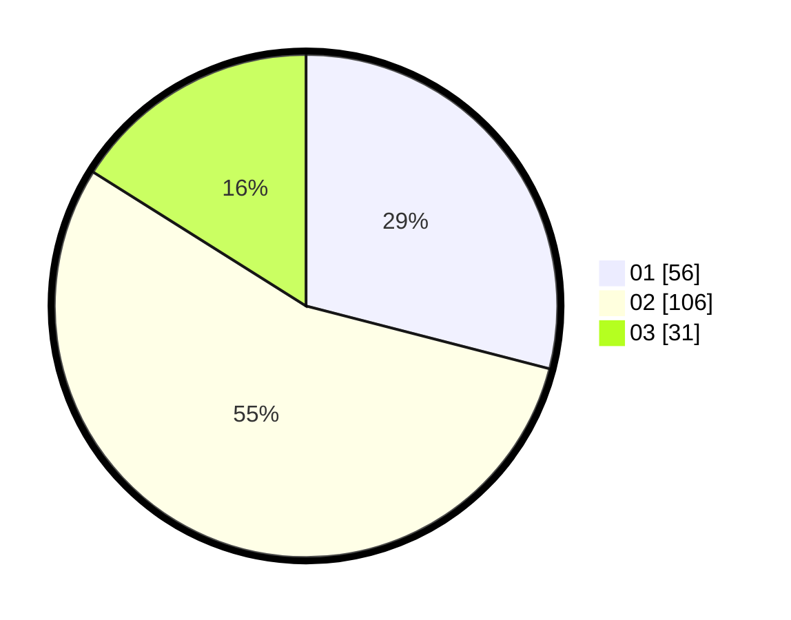

# Hasil

Hasil perolehan suara paslon dapat dilihat pada file paslon-01.txt, paslon-02.txt, dan paslon-03.txt.

Jika tidak ada, artinya data tersebut belum ada pada SIREKAP.

## Perolehan Suara

 * Paslon 01: **56**.
 * Paslon 02: **106**.
 * Paslon 03: **31**.

## Foto C Plano

https://sirekap-obj-formc.kpu.go.id/000b/pemilu/ppwp/31/71/08/10/04/3171081004106-20240214-203229--c357a66f-0a79-4fc7-a63e-7ac575c59249.jpg

https://sirekap-obj-formc.kpu.go.id/000b/pemilu/ppwp/31/71/08/10/04/3171081004106-20240214-203235--b07148ed-36dd-4db4-b181-2db46dded1e4.jpg

https://sirekap-obj-formc.kpu.go.id/000b/pemilu/ppwp/31/71/08/10/04/3171081004106-20240214-203240--e861660e-34ca-467e-bab2-a9e2dc144178.jpg

## DATA PEMILIH TETAP

Jumlah pemilih dalam DPT: **190**.
 * L: **85**.
 * P: **105**.

## DATA PENGGUNA HAK PILIH

Jumlah pengguna hak pilih dalam DPT: **190**.
 * L: **85**.
 * P: **105**.

Jumlah pengguna hak pilih dalam DPTb: **0**.
 * L: **0**.
 * P: **0**.

Jumlah pengguna hak pilih dalam DPK: **3**.
 * L: **0**.
 * P: **3**.

Jumlah pengguna hak pilih: **193**.
 * L: **85**.
 * P: **108**.

## JUMLAH SUARA SAH DAN TIDAK SAH

JUMLAH SELURUH SUARA SAH: **193**.

JUMLAH SUARA TIDAK SAH: **84**.

JUMLAH SELURUH SUARA SAH DAN SUARA TIDAK SAH: **277**.
