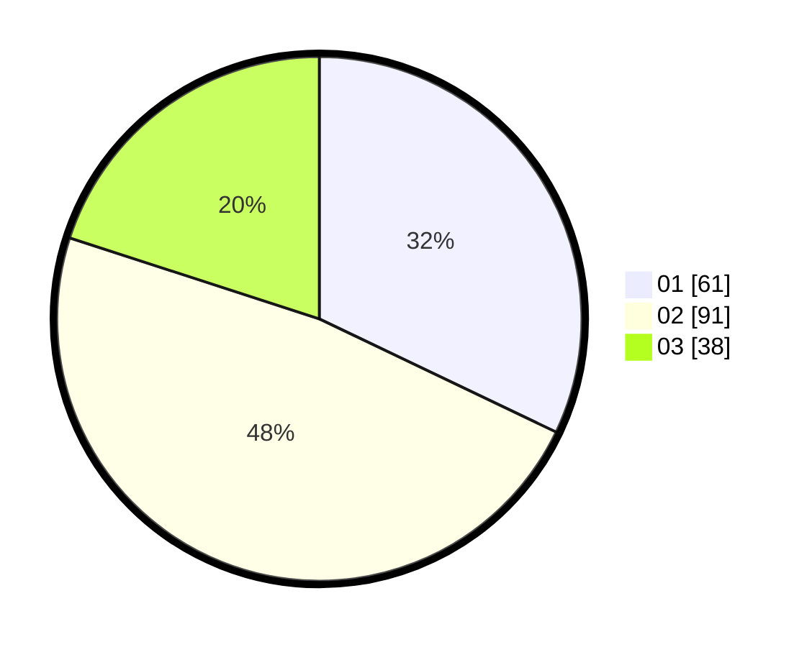

# Hasil

Hasil perolehan suara paslon dapat dilihat pada file paslon-01.txt, paslon-02.txt, dan paslon-03.txt.

Jika tidak ada, artinya data tersebut belum ada pada SIREKAP.

## Perolehan Suara

 * Paslon 01: **61**.
 * Paslon 02: **91**.
 * Paslon 03: **38**.

## Foto C Plano

https://sirekap-obj-formc.kpu.go.id/fbd2/pemilu/ppwp/31/71/08/10/04/3171081004107-20240216-035928--0f3ea0f0-c867-4df1-97ec-ba8911545559.jpg

https://sirekap-obj-formc.kpu.go.id/fbd2/pemilu/ppwp/31/71/08/10/04/3171081004107-20240216-035930--f166abc4-1abd-4a08-88c6-70b8ca768d34.jpg

https://sirekap-obj-formc.kpu.go.id/fbd2/pemilu/ppwp/31/71/08/10/04/3171081004107-20240216-035929--cebc4acd-df85-4ba7-a278-34fb6cfdf441.jpg

## DATA PEMILIH TETAP

Jumlah pemilih dalam DPT: **255**.
 * L: **134**.
 * P: **121**.

## DATA PENGGUNA HAK PILIH

Jumlah pengguna hak pilih dalam DPT: **188**.
 * L: **92**.
 * P: **96**.

Jumlah pengguna hak pilih dalam DPTb: **0**.
 * L: **0**.
 * P: **0**.

Jumlah pengguna hak pilih dalam DPK: **2**.
 * L: **0**.
 * P: **2**.

Jumlah pengguna hak pilih: **190**.
 * L: **92**.
 * P: **98**.

## JUMLAH SUARA SAH DAN TIDAK SAH

JUMLAH SELURUH SUARA SAH: **190**.

JUMLAH SUARA TIDAK SAH: **0**.

JUMLAH SELURUH SUARA SAH DAN SUARA TIDAK SAH: **190**.
