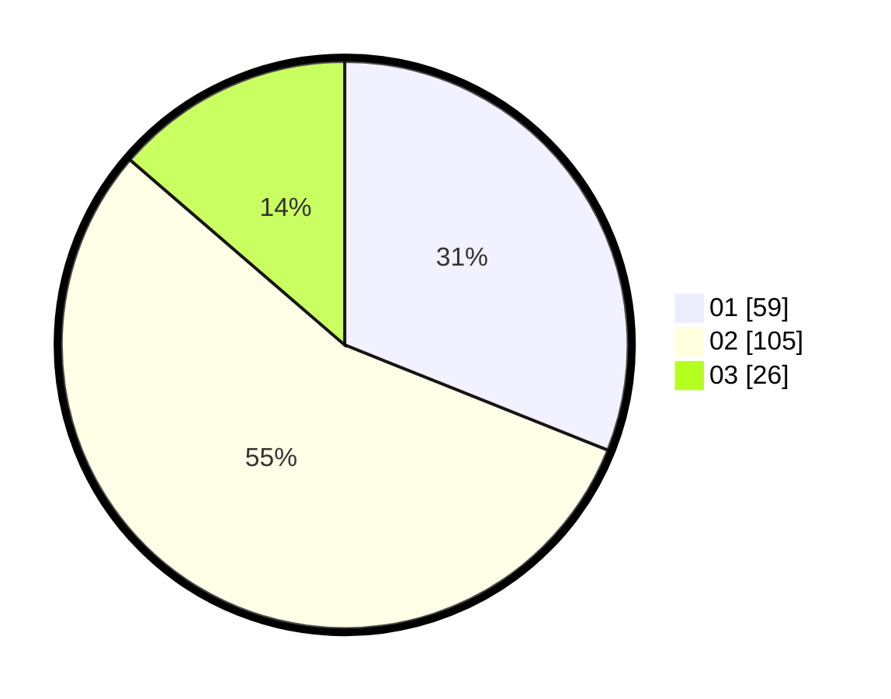

# Hasil

Hasil perolehan suara paslon dapat dilihat pada file paslon-01.txt, paslon-02.txt, dan paslon-03.txt.

Jika tidak ada, artinya data tersebut belum ada pada SIREKAP.

## Perolehan Suara

 * Paslon 01: **59**.
 * Paslon 02: **105**.
 * Paslon 03: **26**.

## Foto C Plano

https://sirekap-obj-formc.kpu.go.id/b873/pemilu/ppwp/31/71/08/10/04/3171081004109-20240214-201801--a0ef5e27-ffcf-4aee-9d01-37adfb9d9b72.jpg

https://sirekap-obj-formc.kpu.go.id/b873/pemilu/ppwp/31/71/08/10/04/3171081004109-20240215-002320--cdcf882b-396f-48d9-9416-012ced3d8110.jpg

https://sirekap-obj-formc.kpu.go.id/b873/pemilu/ppwp/31/71/08/10/04/3171081004109-20240214-201838--1be2fca5-779f-4d28-8404-e585dc9608a1.jpg
