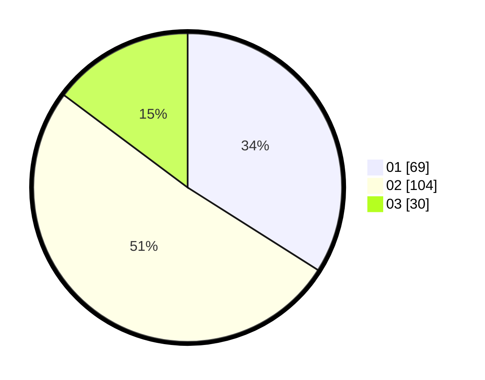

# Hasil

Hasil perolehan suara paslon dapat dilihat pada file paslon-01.txt, paslon-02.txt, dan paslon-03.txt.

Jika tidak ada, artinya data tersebut belum ada pada SIREKAP.

## Perolehan Suara

 * Paslon 01: **69**.
 * Paslon 02: **104**.
 * Paslon 03: **30**.

## Foto C Plano

https://sirekap-obj-formc.kpu.go.id/be57/pemilu/ppwp/31/71/08/10/04/3171081004110-20240214-202550--c938ff28-9a3c-4bba-8219-5a5c8c56fb63.jpg

https://sirekap-obj-formc.kpu.go.id/be57/pemilu/ppwp/31/71/08/10/04/3171081004110-20240214-204602--09acaa90-030d-4427-aef9-aa5f3180089b.jpg

https://sirekap-obj-formc.kpu.go.id/be57/pemilu/ppwp/31/71/08/10/04/3171081004110-20240214-202619--b3fc0497-b68a-4e09-ade0-15667bbce136.jpg
