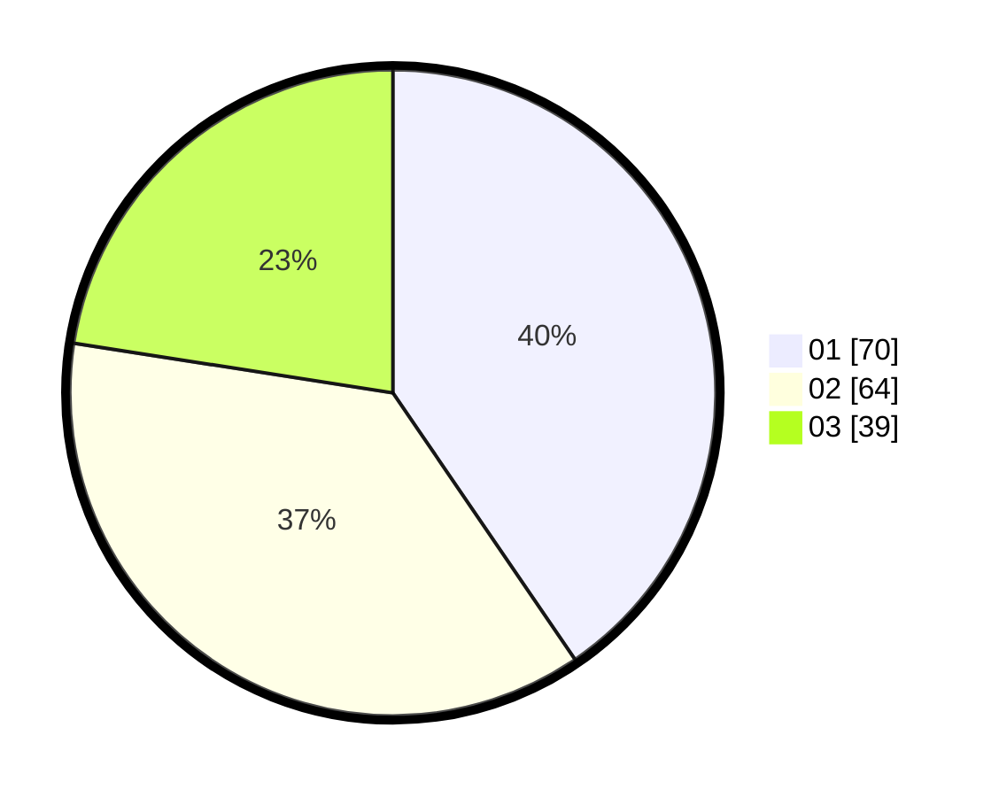

# Hasil

Hasil perolehan suara paslon dapat dilihat pada file paslon-01.txt, paslon-02.txt, dan paslon-03.txt.

Jika tidak ada, artinya data tersebut belum ada pada SIREKAP.

## Perolehan Suara

 * Paslon 01: **70**.
 * Paslon 02: **64**.
 * Paslon 03: **39**.

## Foto C Plano

https://sirekap-obj-formc.kpu.go.id/a9fc/pemilu/ppwp/31/71/08/10/04/3171081004111-20240215-002451--6ba109ca-f2be-4a30-9d2e-afdf9a2ab87b.jpg

https://sirekap-obj-formc.kpu.go.id/a9fc/pemilu/ppwp/31/71/08/10/04/3171081004111-20240215-002928--6e55f1ac-106a-4d9c-876b-adaf76473c64.jpg

https://sirekap-obj-formc.kpu.go.id/a9fc/pemilu/ppwp/31/71/08/10/04/3171081004111-20240215-002731--973da910-9538-4f24-a695-ff7bdef38bf1.jpg

## DATA PEMILIH TETAP

Jumlah pemilih dalam DPT: **257**.
 * L: **137**.
 * P: **120**.

## DATA PENGGUNA HAK PILIH

Jumlah pengguna hak pilih dalam DPT: **177**.
 * L: **92**.
 * P: **85**.

Jumlah pengguna hak pilih dalam DPTb: **0**.
 * L: **0**.
 * P: **0**.

Jumlah pengguna hak pilih dalam DPK: **0**.
 * L: **0**.
 * P: **0**.

Jumlah pengguna hak pilih: **177**.
 * L: **42**.
 * P: **85**.

## JUMLAH SUARA SAH DAN TIDAK SAH

JUMLAH SELURUH SUARA SAH: **173**.

JUMLAH SUARA TIDAK SAH: **4**.

JUMLAH SELURUH SUARA SAH DAN SUARA TIDAK SAH: **177**.
