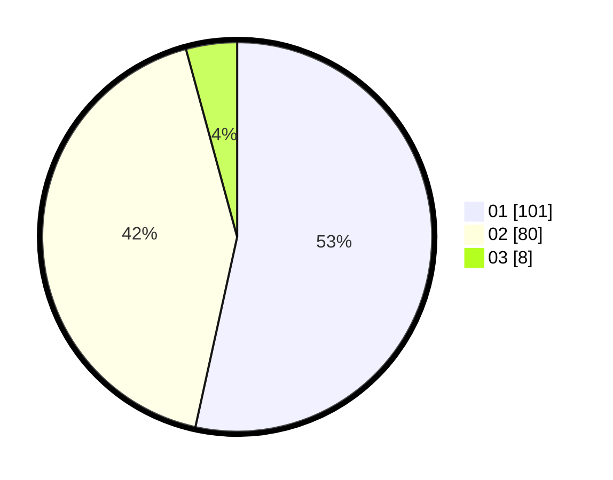

# Hasil

Hasil perolehan suara paslon dapat dilihat pada file paslon-01.txt, paslon-02.txt, dan paslon-03.txt.

Jika tidak ada, artinya data tersebut belum ada pada SIREKAP.

## Perolehan Suara

 * Paslon 01: **101**.
 * Paslon 02: **80**.
 * Paslon 03: **8**.

## Foto C Plano

https://sirekap-obj-formc.kpu.go.id/f175/pemilu/ppwp/31/71/08/10/04/3171081004118-20240215-022631--6fee3446-89fb-4459-8a19-e152ac245e18.jpg

https://sirekap-obj-formc.kpu.go.id/f175/pemilu/ppwp/31/71/08/10/04/3171081004118-20240215-023001--0c8087f2-3e6c-498e-8dc6-6586d4abdec4.jpg

https://sirekap-obj-formc.kpu.go.id/f175/pemilu/ppwp/31/71/08/10/04/3171081004118-20240215-023114--e735eb9e-655e-432d-be6c-245abe0141aa.jpg

## DATA PEMILIH TETAP

Jumlah pemilih dalam DPT: **259**.
 * L: **133**.
 * P: **126**.

## DATA PENGGUNA HAK PILIH

Jumlah pengguna hak pilih dalam DPT: **190**.
 * L: **92**.
 * P: **98**.

Jumlah pengguna hak pilih dalam DPTb: **0**.
 * L: **0**.
 * P: **0**.

Jumlah pengguna hak pilih dalam DPK: **1**.
 * L: **1**.
 * P: **0**.

Jumlah pengguna hak pilih: **191**.
 * L: **93**.
 * P: **98**.

## JUMLAH SUARA SAH DAN TIDAK SAH

JUMLAH SELURUH SUARA SAH: **189**.

JUMLAH SUARA TIDAK SAH: **2**.

JUMLAH SELURUH SUARA SAH DAN SUARA TIDAK SAH: **191**.
