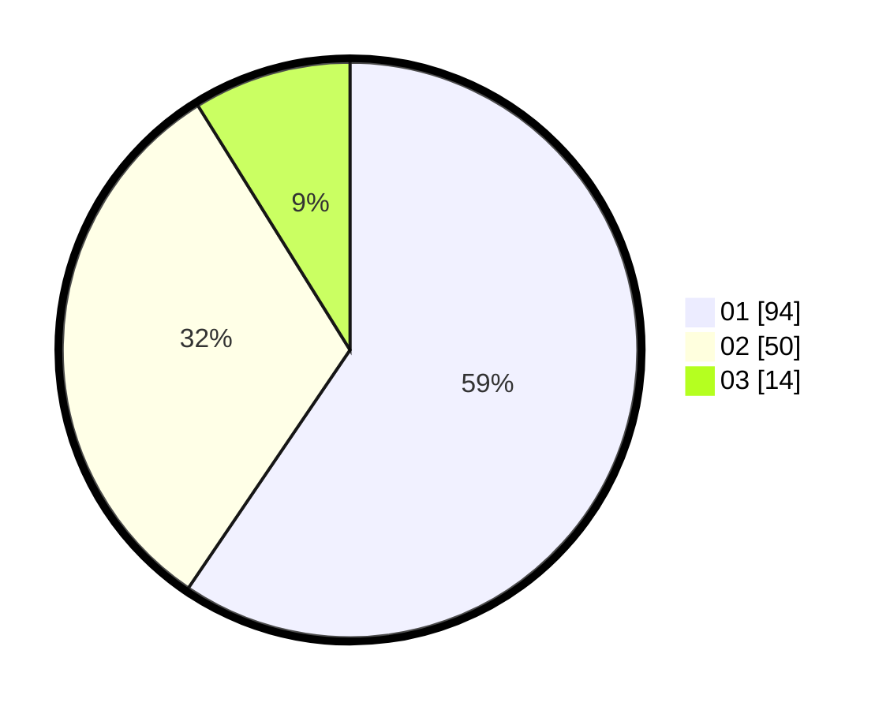

# Hasil

Hasil perolehan suara paslon dapat dilihat pada file paslon-01.txt, paslon-02.txt, dan paslon-03.txt.

Jika tidak ada, artinya data tersebut belum ada pada SIREKAP.

## Perolehan Suara

 * Paslon 01: **94**.
 * Paslon 02: **50**.
 * Paslon 03: **14**.

## Foto C Plano

https://sirekap-obj-formc.kpu.go.id/789d/pemilu/ppwp/31/71/08/10/04/3171081004125-20240215-210530--d171c24e-0f63-4b83-a352-301a13eb834c.jpg

https://sirekap-obj-formc.kpu.go.id/789d/pemilu/ppwp/31/71/08/10/04/3171081004125-20240215-210532--4c763630-f747-47d3-ad00-9ed121bd4149.jpg

https://sirekap-obj-formc.kpu.go.id/789d/pemilu/ppwp/31/71/08/10/04/3171081004125-20240215-210531--69e34509-e9a6-449b-833a-b1f43d77f022.jpg

## DATA PEMILIH TETAP

Jumlah pemilih dalam DPT: **233**.
 * L: **119**.
 * P: **114**.

## DATA PENGGUNA HAK PILIH

Jumlah pengguna hak pilih dalam DPT: **164**.
 * L: **76**.
 * P: **88**.

Jumlah pengguna hak pilih dalam DPTb: **4**.
 * L: **3**.
 * P: **1**.

Jumlah pengguna hak pilih dalam DPK: **1**.
 * L: **1**.
 * P: **0**.

Jumlah pengguna hak pilih: **169**.
 * L: **80**.
 * P: **89**.

## JUMLAH SUARA SAH DAN TIDAK SAH

JUMLAH SELURUH SUARA SAH: **158**.

JUMLAH SUARA TIDAK SAH: **11**.

JUMLAH SELURUH SUARA SAH DAN SUARA TIDAK SAH: **169**.
