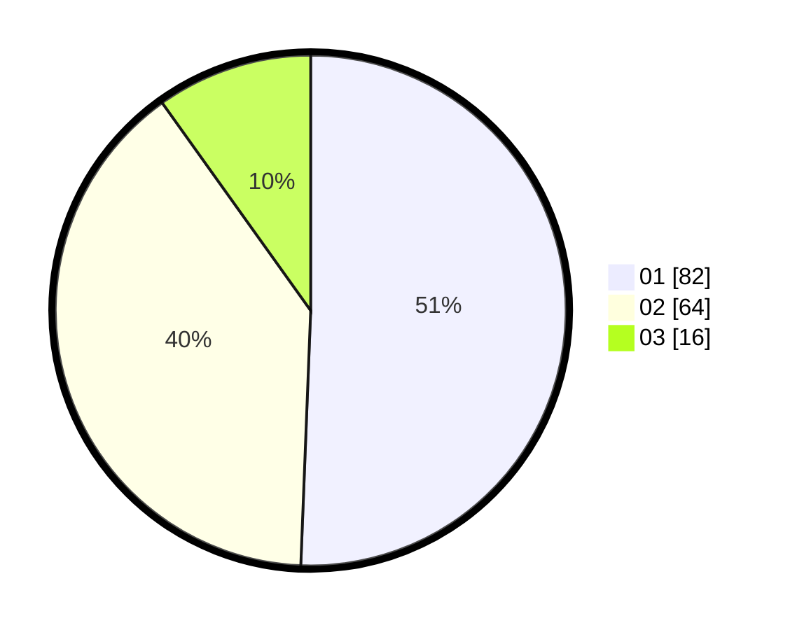

# Hasil

Hasil perolehan suara paslon dapat dilihat pada file paslon-01.txt, paslon-02.txt, dan paslon-03.txt.

Jika tidak ada, artinya data tersebut belum ada pada SIREKAP.

## Perolehan Suara

 * Paslon 01: **82**.
 * Paslon 02: **64**.
 * Paslon 03: **16**.

## Foto C Plano

https://sirekap-obj-formc.kpu.go.id/af45/pemilu/ppwp/31/71/08/10/04/3171081004127-20240214-215849--f931331d-9d47-4ca7-a059-a6d4505d0399.jpg

https://sirekap-obj-formc.kpu.go.id/af45/pemilu/ppwp/31/71/08/10/04/3171081004127-20240214-215922--55248b34-199f-497f-a803-403d39b52f21.jpg

https://sirekap-obj-formc.kpu.go.id/af45/pemilu/ppwp/31/71/08/10/04/3171081004127-20240214-215932--11bde4cb-ad52-4bb8-9b1f-14283b93d2a8.jpg
