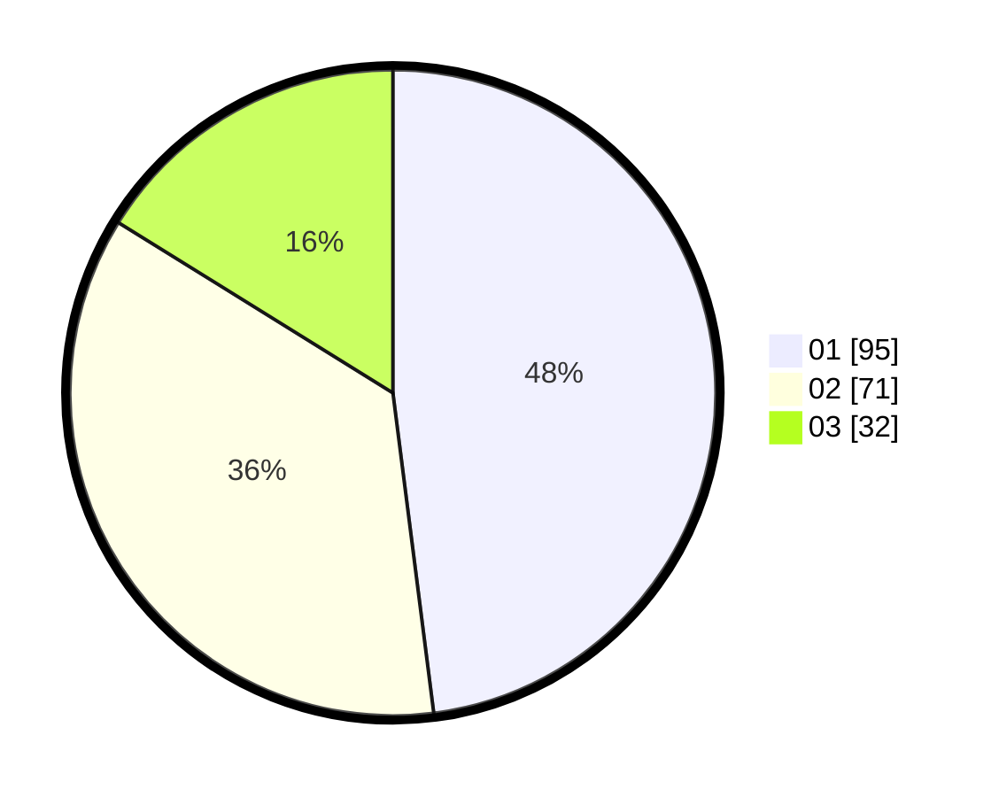

# Hasil

Hasil perolehan suara paslon dapat dilihat pada file paslon-01.txt, paslon-02.txt, dan paslon-03.txt.

Jika tidak ada, artinya data tersebut belum ada pada SIREKAP.

## Perolehan Suara

 * Paslon 01: **95**.
 * Paslon 02: **71**.
 * Paslon 03: **32**.

## Foto C Plano

https://sirekap-obj-formc.kpu.go.id/6a87/pemilu/ppwp/31/71/08/10/04/3171081004134-20240216-030117--c9fec111-252b-431a-99a1-a954985c71a2.jpg

https://sirekap-obj-formc.kpu.go.id/6a87/pemilu/ppwp/31/71/08/10/04/3171081004134-20240216-030118--5110efae-6f9d-4186-8e94-4c62b38e6b88.jpg

https://sirekap-obj-formc.kpu.go.id/6a87/pemilu/ppwp/31/71/08/10/04/3171081004134-20240216-030117--f578a9f6-052c-4ffd-aff9-9de504488a5d.jpg

## DATA PEMILIH TETAP

Jumlah pemilih dalam DPT: **265**.
 * L: **126**.
 * P: **139**.

## DATA PENGGUNA HAK PILIH

Jumlah pengguna hak pilih dalam DPT: **199**.
 * L: **89**.
 * P: **110**.

Jumlah pengguna hak pilih dalam DPTb: **0**.
 * L: **0**.
 * P: **0**.

Jumlah pengguna hak pilih dalam DPK: **2**.
 * L: **2**.
 * P: **0**.

Jumlah pengguna hak pilih: **201**.
 * L: **91**.
 * P: **110**.

## JUMLAH SUARA SAH DAN TIDAK SAH

JUMLAH SELURUH SUARA SAH: **198**.

JUMLAH SUARA TIDAK SAH: **5**.

JUMLAH SELURUH SUARA SAH DAN SUARA TIDAK SAH: **203**.
