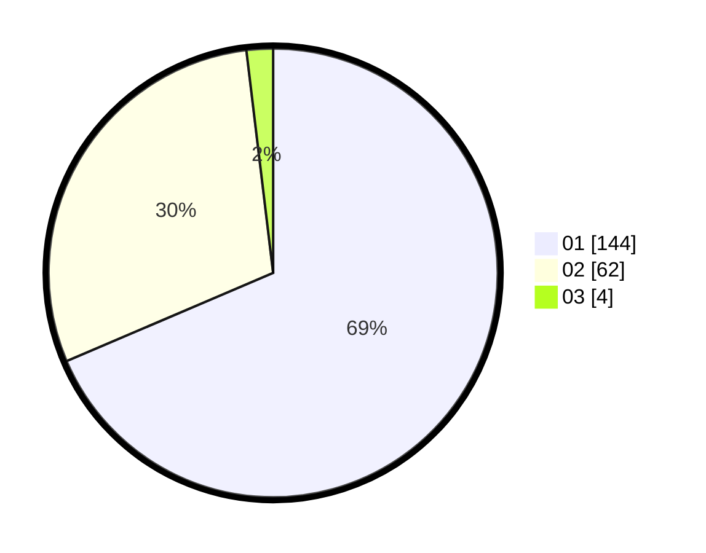

# Hasil

Hasil perolehan suara paslon dapat dilihat pada file paslon-01.txt, paslon-02.txt, dan paslon-03.txt.

Jika tidak ada, artinya data tersebut belum ada pada SIREKAP.

## Perolehan Suara

 * Paslon 01: **144**.
 * Paslon 02: **62**.
 * Paslon 03: **4**.

## Foto C Plano

https://sirekap-obj-formc.kpu.go.id/f368/pemilu/ppwp/31/72/01/10/01/3172011001002-20240217-143522--c9b39ad5-9912-45d5-ae29-1627d38aafd2.jpg

https://sirekap-obj-formc.kpu.go.id/f368/pemilu/ppwp/31/72/01/10/01/3172011001002-20240215-004639--f3eb58db-8ad0-4680-b54f-08102c0c3c75.jpg

https://sirekap-obj-formc.kpu.go.id/f368/pemilu/ppwp/31/72/01/10/01/3172011001002-20240217-143702--16341ee1-f8b8-4652-98da-433d564224d4.jpg
