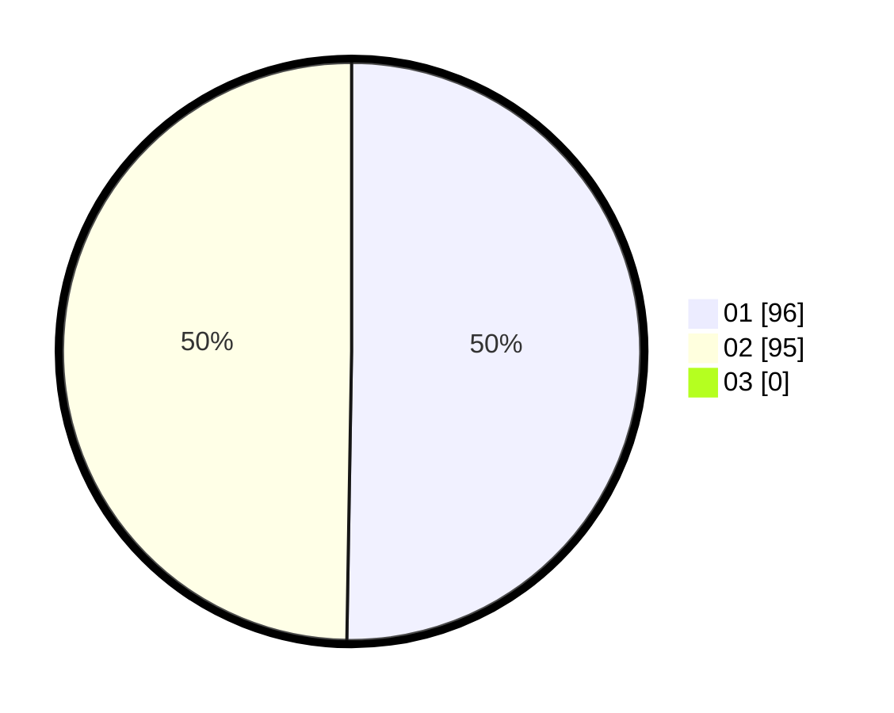

# Hasil

Hasil perolehan suara paslon dapat dilihat pada file paslon-01.txt, paslon-02.txt, dan paslon-03.txt.

Jika tidak ada, artinya data tersebut belum ada pada SIREKAP.

## Perolehan Suara

 * Paslon 01: **96**.
 * Paslon 02: **95**.
 * Paslon 03: **0**.

## Foto C Plano

https://sirekap-obj-formc.kpu.go.id/f3ab/pemilu/ppwp/31/72/01/10/01/3172011001018-20240216-211914--82bab711-2eef-49de-b215-3b681052d860.jpg

https://sirekap-obj-formc.kpu.go.id/f3ab/pemilu/ppwp/31/72/01/10/01/3172011001018-20240216-212130--5c845e12-78b9-472d-a237-41fb3d6e7a8b.jpg

https://sirekap-obj-formc.kpu.go.id/f3ab/pemilu/ppwp/31/72/01/10/01/3172011001018-20240216-211927--a7a93899-2a98-455a-b136-13dcf7f3a74b.jpg

## DATA PEMILIH TETAP

Jumlah pemilih dalam DPT: **239**.
 * L: **122**.
 * P: **117**.

## DATA PENGGUNA HAK PILIH

Jumlah pengguna hak pilih dalam DPT: **199**.
 * L: **101**.
 * P: **98**.

Jumlah pengguna hak pilih dalam DPTb: **0**.
 * L: **0**.
 * P: **0**.

Jumlah pengguna hak pilih dalam DPK: **2**.
 * L: **0**.
 * P: **2**.

Jumlah pengguna hak pilih: **201**.
 * L: **101**.
 * P: **100**.

## JUMLAH SUARA SAH DAN TIDAK SAH

JUMLAH SELURUH SUARA SAH: **191**.

JUMLAH SUARA TIDAK SAH: **10**.

JUMLAH SELURUH SUARA SAH DAN SUARA TIDAK SAH: **201**.
