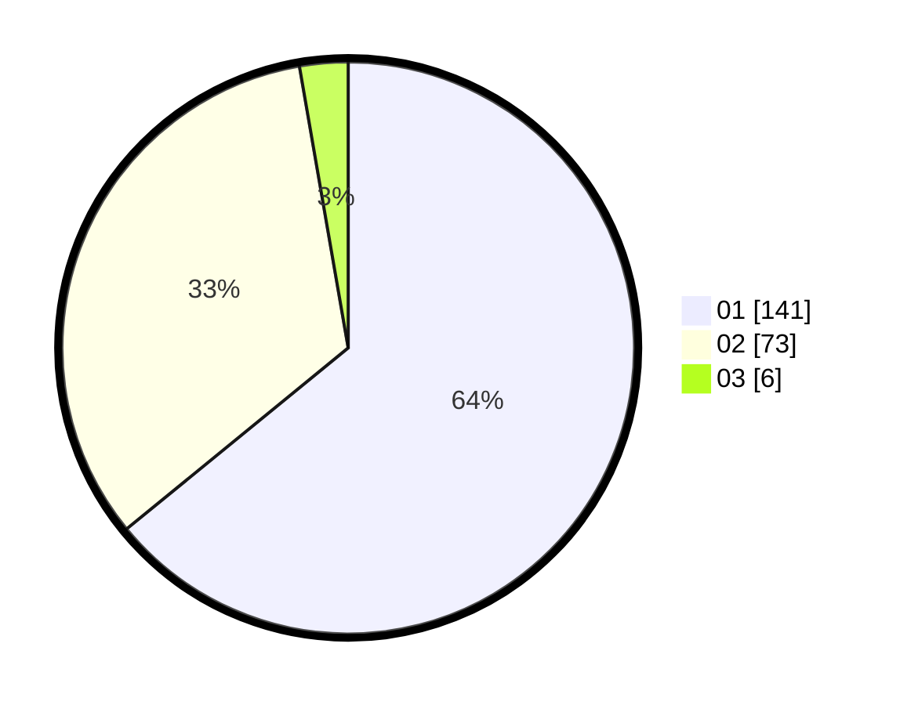

# Hasil

Hasil perolehan suara paslon dapat dilihat pada file paslon-01.txt, paslon-02.txt, dan paslon-03.txt.

Jika tidak ada, artinya data tersebut belum ada pada SIREKAP.

## Perolehan Suara

 * Paslon 01: **141**.
 * Paslon 02: **73**.
 * Paslon 03: **6**.

## Foto C Plano

https://sirekap-obj-formc.kpu.go.id/3bc3/pemilu/ppwp/31/72/01/10/01/3172011001019-20240216-151402--7f6e7a15-75af-4109-be7b-ec967671702b.jpg

https://sirekap-obj-formc.kpu.go.id/3bc3/pemilu/ppwp/31/72/01/10/01/3172011001019-20240216-150542--794cd529-e8b5-4354-adf5-df29120c4a9b.jpg

https://sirekap-obj-formc.kpu.go.id/3bc3/pemilu/ppwp/31/72/01/10/01/3172011001019-20240216-150631--a4955ce1-84df-49c7-bcc4-b0ebfa71fd5e.jpg
