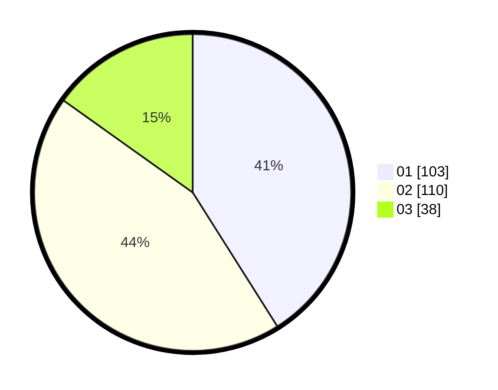

# Hasil

Hasil perolehan suara paslon dapat dilihat pada file paslon-01.txt, paslon-02.txt, dan paslon-03.txt.

Jika tidak ada, artinya data tersebut belum ada pada SIREKAP.

## Perolehan Suara

 * Paslon 01: **103**.
 * Paslon 02: **110**.
 * Paslon 03: **38**.

## Foto C Plano

https://sirekap-obj-formc.kpu.go.id/0da5/pemilu/ppwp/31/72/01/10/01/3172011001051-20240214-193604--b71e58ea-31e8-400c-a579-77668cb9ab54.jpg

https://sirekap-obj-formc.kpu.go.id/0da5/pemilu/ppwp/31/72/01/10/01/3172011001051-20240214-193152--a9533b44-eb9f-4229-9a6d-7939a7adda6a.jpg

https://sirekap-obj-formc.kpu.go.id/0da5/pemilu/ppwp/31/72/01/10/01/3172011001051-20240214-193721--45962144-7c51-4688-9973-e05e03cea8eb.jpg
