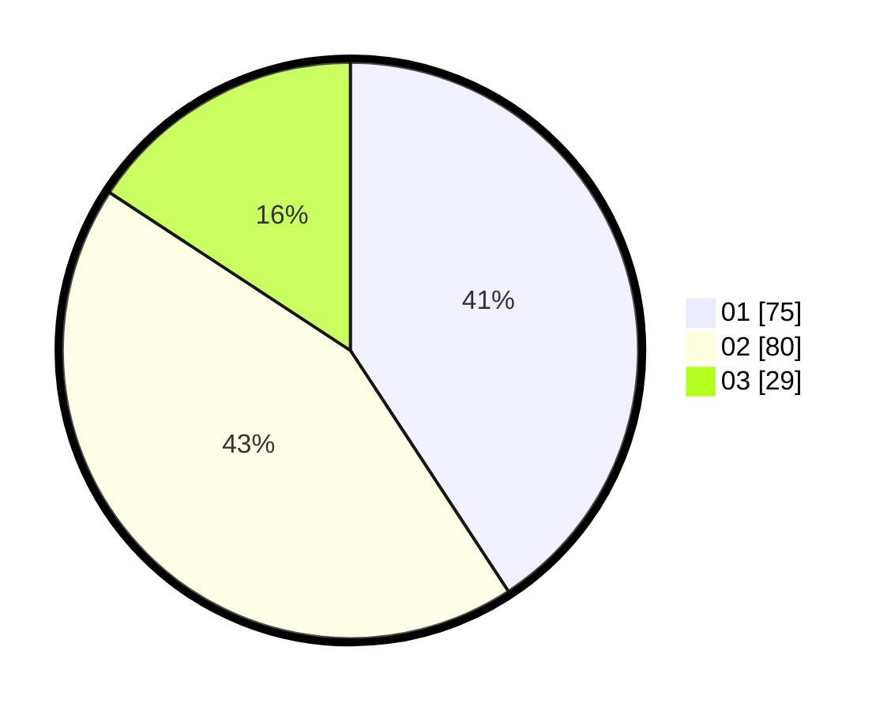

# Hasil

Hasil perolehan suara paslon dapat dilihat pada file paslon-01.txt, paslon-02.txt, dan paslon-03.txt.

Jika tidak ada, artinya data tersebut belum ada pada SIREKAP.

## Perolehan Suara

 * Paslon 01: **75**.
 * Paslon 02: **80**.
 * Paslon 03: **29**.

## Foto C Plano

https://sirekap-obj-formc.kpu.go.id/018e/pemilu/ppwp/31/72/01/10/01/3172011001105-20240216-003648--5e19212c-8df8-48ab-86de-f92332fad99a.jpg

https://sirekap-obj-formc.kpu.go.id/018e/pemilu/ppwp/31/72/01/10/01/3172011001105-20240216-003724--29594c04-0663-4277-ada1-0d107e58f0b2.jpg

https://sirekap-obj-formc.kpu.go.id/018e/pemilu/ppwp/31/72/01/10/01/3172011001105-20240216-003747--3e4f62d3-7ab2-4ee0-97fc-059b3109d39a.jpg
