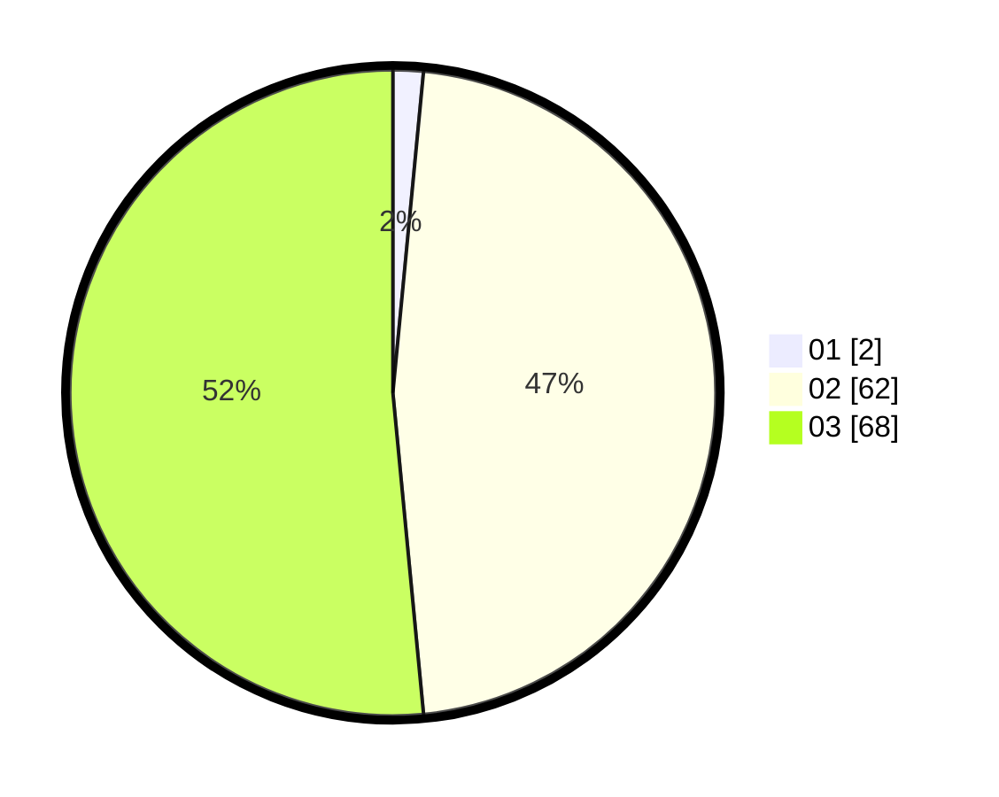

# Hasil

Hasil perolehan suara paslon dapat dilihat pada file paslon-01.txt, paslon-02.txt, dan paslon-03.txt.

Jika tidak ada, artinya data tersebut belum ada pada SIREKAP.

## Perolehan Suara

 * Paslon 01: **2**.
 * Paslon 02: **62**.
 * Paslon 03: **68**.

## Foto C Plano

https://sirekap-obj-formc.kpu.go.id/af7e/pemilu/ppwp/31/72/01/10/01/3172011001106-20240216-144302--158a7e73-da8e-4d1e-9c6d-f301113d0dd5.jpg

https://sirekap-obj-formc.kpu.go.id/af7e/pemilu/ppwp/31/72/01/10/01/3172011001106-20240216-144303--46299070-58c9-4540-9432-1b0d58df6e06.jpg

https://sirekap-obj-formc.kpu.go.id/af7e/pemilu/ppwp/31/72/01/10/01/3172011001106-20240216-144302--8397ee57-d78d-466f-9f65-1641d3c26590.jpg

## DATA PEMILIH TETAP

Jumlah pemilih dalam DPT: **166**.
 * L: **78**.
 * P: **88**.

## DATA PENGGUNA HAK PILIH

Jumlah pengguna hak pilih dalam DPT: **118**.
 * L: **59**.
 * P: **59**.

Jumlah pengguna hak pilih dalam DPTb: **14**.
 * L: **7**.
 * P: **7**.

Jumlah pengguna hak pilih dalam DPK: **1**.
 * L: **0**.
 * P: **1**.

Jumlah pengguna hak pilih: **133**.
 * L: **66**.
 * P: **67**.

## JUMLAH SUARA SAH DAN TIDAK SAH

JUMLAH SELURUH SUARA SAH: **132**.

JUMLAH SUARA TIDAK SAH: **1**.

JUMLAH SELURUH SUARA SAH DAN SUARA TIDAK SAH: **133**.
