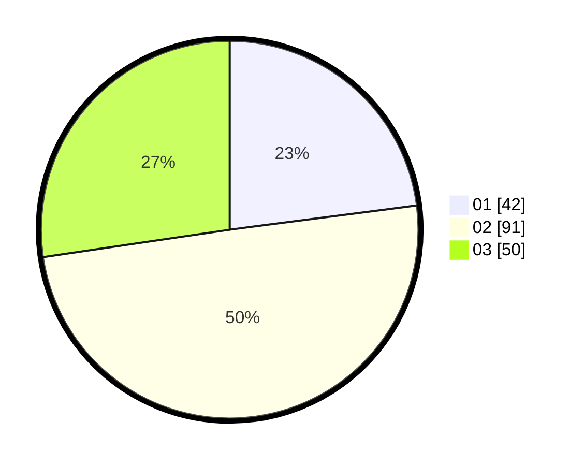

# Hasil

Hasil perolehan suara paslon dapat dilihat pada file paslon-01.txt, paslon-02.txt, dan paslon-03.txt.

Jika tidak ada, artinya data tersebut belum ada pada SIREKAP.

## Perolehan Suara

 * Paslon 01: **42**.
 * Paslon 02: **91**.
 * Paslon 03: **50**.

## Foto C Plano

https://sirekap-obj-formc.kpu.go.id/0c31/pemilu/ppwp/31/72/01/10/01/3172011001116-20240214-234700--eb3454fa-1be4-4d13-b638-2b6ea49a1941.jpg

https://sirekap-obj-formc.kpu.go.id/0c31/pemilu/ppwp/31/72/01/10/01/3172011001116-20240215-014034--e9391890-30ef-4291-ba93-39a844f454b4.jpg

https://sirekap-obj-formc.kpu.go.id/0c31/pemilu/ppwp/31/72/01/10/01/3172011001116-20240215-013907--ddf6298a-3a05-431f-9015-64df678ece29.jpg
