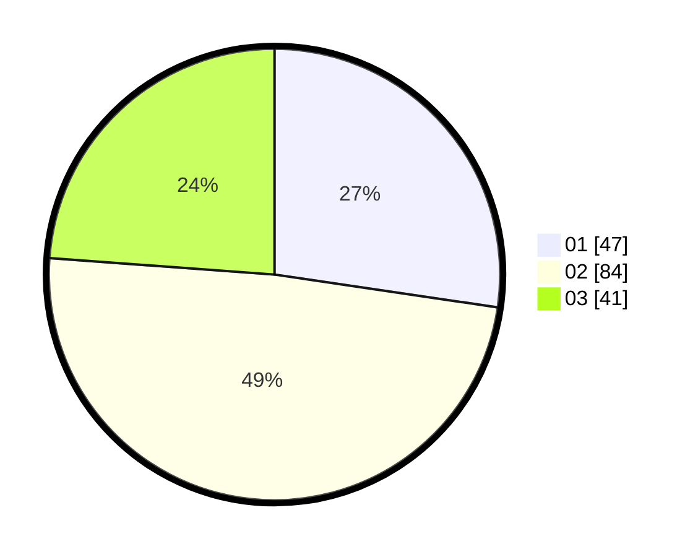

# Hasil

Hasil perolehan suara paslon dapat dilihat pada file paslon-01.txt, paslon-02.txt, dan paslon-03.txt.

Jika tidak ada, artinya data tersebut belum ada pada SIREKAP.

## Perolehan Suara

 * Paslon 01: **47**.
 * Paslon 02: **84**.
 * Paslon 03: **41**.

## Foto C Plano

https://sirekap-obj-formc.kpu.go.id/e25f/pemilu/ppwp/31/72/01/10/01/3172011001123-20240214-210438--bbd467c6-1677-40f6-be6b-d9f3fed7077b.jpg

https://sirekap-obj-formc.kpu.go.id/e25f/pemilu/ppwp/31/72/01/10/01/3172011001123-20240214-201551--2a424f29-6cb0-44da-bf2b-5c7f4c79d824.jpg

https://sirekap-obj-formc.kpu.go.id/e25f/pemilu/ppwp/31/72/01/10/01/3172011001123-20240214-210538--05940b01-f359-4f7a-b9eb-37d76ed45734.jpg
