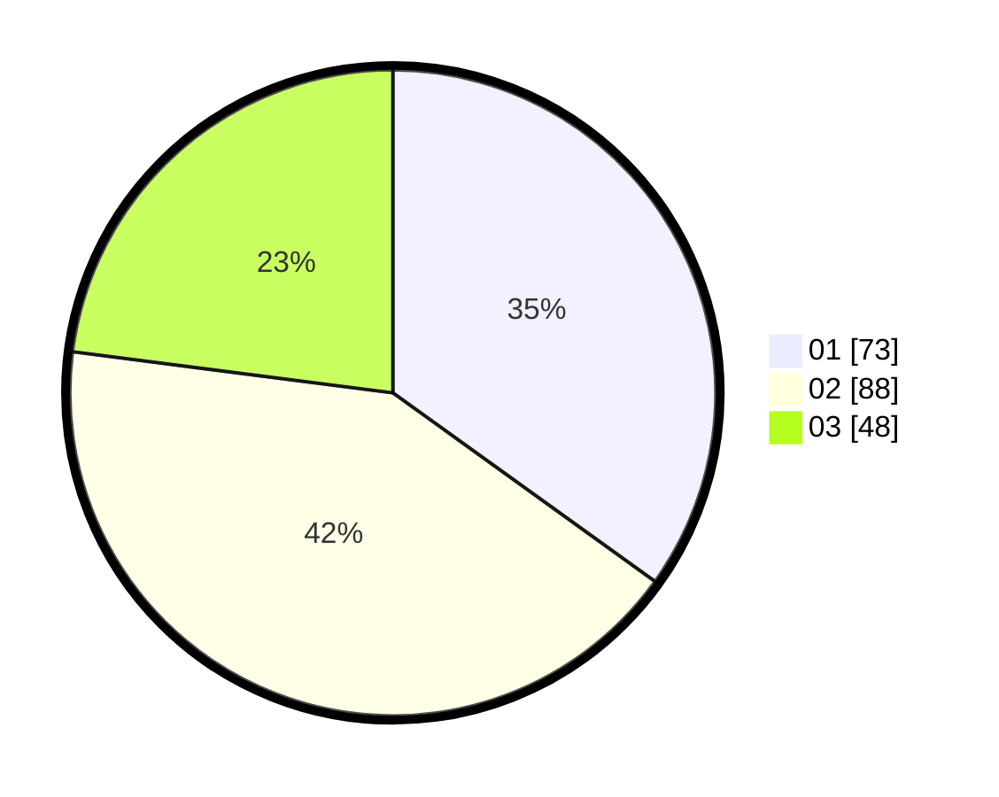

# Hasil

Hasil perolehan suara paslon dapat dilihat pada file paslon-01.txt, paslon-02.txt, dan paslon-03.txt.

Jika tidak ada, artinya data tersebut belum ada pada SIREKAP.

## Perolehan Suara

 * Paslon 01: **73**.
 * Paslon 02: **88**.
 * Paslon 03: **48**.

## Foto C Plano

https://sirekap-obj-formc.kpu.go.id/96e2/pemilu/ppwp/31/72/01/10/01/3172011001128-20240214-194118--ab619aac-08c8-437a-958f-de3557e9feba.jpg

https://sirekap-obj-formc.kpu.go.id/96e2/pemilu/ppwp/31/72/01/10/01/3172011001128-20240214-193508--0c969077-e36f-4da8-b2b3-bb8942e342a5.jpg

https://sirekap-obj-formc.kpu.go.id/96e2/pemilu/ppwp/31/72/01/10/01/3172011001128-20240215-002545--944d0c5e-5d92-4903-91c4-c9ed29699ba7.jpg
