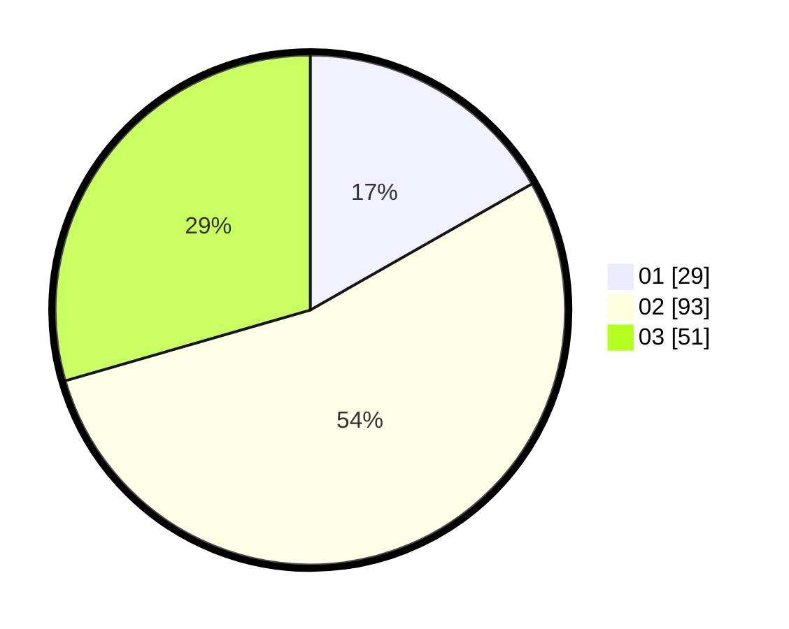

# Hasil

Hasil perolehan suara paslon dapat dilihat pada file paslon-01.txt, paslon-02.txt, dan paslon-03.txt.

Jika tidak ada, artinya data tersebut belum ada pada SIREKAP.

## Perolehan Suara

 * Paslon 01: **29**.
 * Paslon 02: **93**.
 * Paslon 03: **51**.

## Foto C Plano

https://sirekap-obj-formc.kpu.go.id/db92/pemilu/ppwp/31/72/01/10/01/3172011001131-20240214-155031--e5e9fb39-162c-40e9-ba41-3a4240f62fd9.jpg

https://sirekap-obj-formc.kpu.go.id/db92/pemilu/ppwp/31/72/01/10/01/3172011001131-20240214-155821--9118ce33-0eeb-4f74-8a55-74a5ac416759.jpg

https://sirekap-obj-formc.kpu.go.id/db92/pemilu/ppwp/31/72/01/10/01/3172011001131-20240214-185258--36f0d613-e51c-433c-b908-a03b1b89833c.jpg

## DATA PEMILIH TETAP

Jumlah pemilih dalam DPT: **244**.
 * L: **134**.
 * P: **110**.

## DATA PENGGUNA HAK PILIH

Jumlah pengguna hak pilih dalam DPT: **171**.
 * L: **85**.
 * P: **86**.

Jumlah pengguna hak pilih dalam DPTb: **4**.
 * L: **2**.
 * P: **2**.

Jumlah pengguna hak pilih dalam DPK: **0**.
 * L: **0**.
 * P: **0**.

Jumlah pengguna hak pilih: **175**.
 * L: **87**.
 * P: **88**.

## JUMLAH SUARA SAH DAN TIDAK SAH

JUMLAH SELURUH SUARA SAH: **173**.

JUMLAH SUARA TIDAK SAH: **2**.

JUMLAH SELURUH SUARA SAH DAN SUARA TIDAK SAH: **175**.
