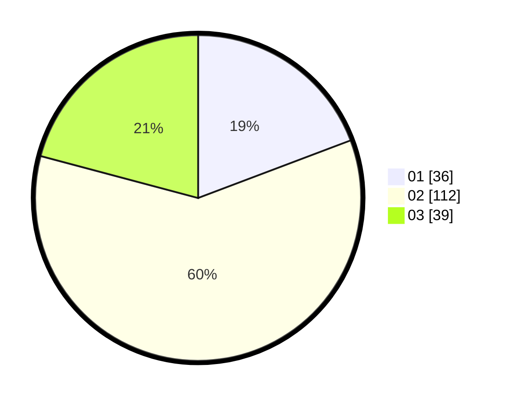

# Hasil

Hasil perolehan suara paslon dapat dilihat pada file paslon-01.txt, paslon-02.txt, dan paslon-03.txt.

Jika tidak ada, artinya data tersebut belum ada pada SIREKAP.

## Perolehan Suara

 * Paslon 01: **36**.
 * Paslon 02: **112**.
 * Paslon 03: **39**.

## Foto C Plano

https://sirekap-obj-formc.kpu.go.id/ef3b/pemilu/ppwp/31/72/01/10/01/3172011001133-20240215-115302--2da1250c-6657-4c2b-80a0-c89b9e5567c7.jpg

https://sirekap-obj-formc.kpu.go.id/ef3b/pemilu/ppwp/31/72/01/10/01/3172011001133-20240215-115427--a1b6f3ea-c089-4f4b-b884-ead04f76fede.jpg

https://sirekap-obj-formc.kpu.go.id/ef3b/pemilu/ppwp/31/72/01/10/01/3172011001133-20240215-115433--947fc2bb-ecec-40fd-a516-7de9deb1825d.jpg
