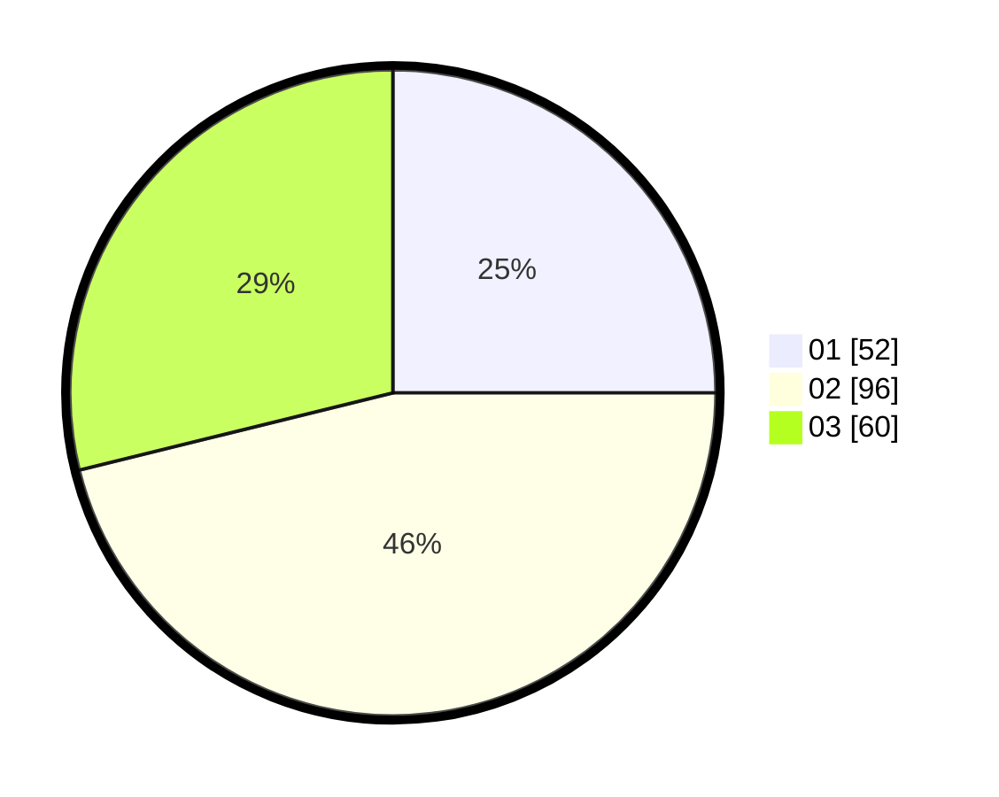

# Hasil

Hasil perolehan suara paslon dapat dilihat pada file paslon-01.txt, paslon-02.txt, dan paslon-03.txt.

Jika tidak ada, artinya data tersebut belum ada pada SIREKAP.

## Perolehan Suara

 * Paslon 01: **52**.
 * Paslon 02: **96**.
 * Paslon 03: **60**.

## Foto C Plano

https://sirekap-obj-formc.kpu.go.id/26ba/pemilu/ppwp/31/72/01/10/01/3172011001138-20240215-224327--79c8f023-b25b-46be-8abc-cfee2767093f.jpg

https://sirekap-obj-formc.kpu.go.id/26ba/pemilu/ppwp/31/72/01/10/01/3172011001138-20240215-224337--18376272-cf1f-4e11-9741-7b812d5a8390.jpg

https://sirekap-obj-formc.kpu.go.id/26ba/pemilu/ppwp/31/72/01/10/01/3172011001138-20240215-224344--aebde7e9-838d-44b4-9b11-1c1e23fc8683.jpg
