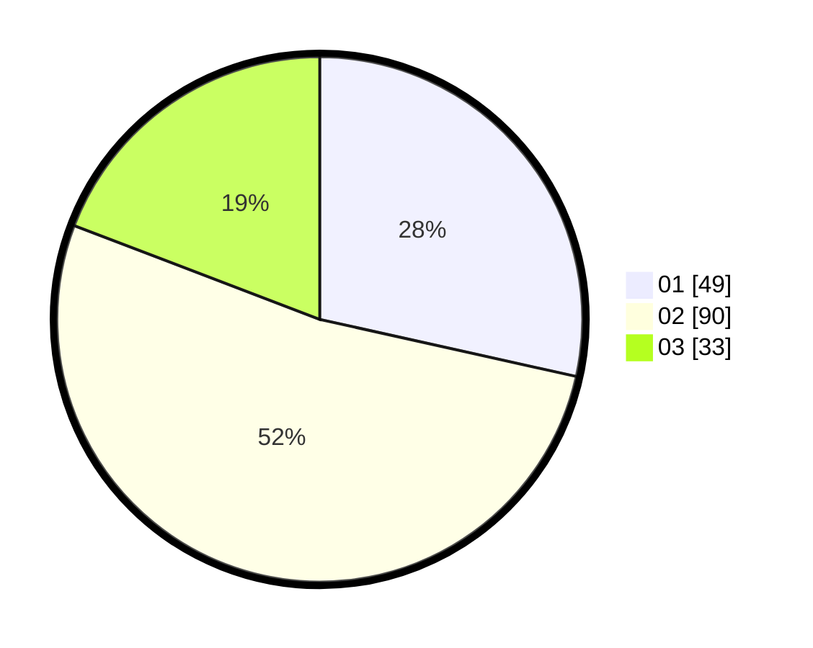

# Hasil

Hasil perolehan suara paslon dapat dilihat pada file paslon-01.txt, paslon-02.txt, dan paslon-03.txt.

Jika tidak ada, artinya data tersebut belum ada pada SIREKAP.

## Perolehan Suara

 * Paslon 01: **49**.
 * Paslon 02: **90**.
 * Paslon 03: **33**.

## Foto C Plano

https://sirekap-obj-formc.kpu.go.id/ab81/pemilu/ppwp/31/72/01/10/01/3172011001139-20240214-224941--9d322daa-8f36-41ad-bc2d-9066262094e3.jpg

https://sirekap-obj-formc.kpu.go.id/ab81/pemilu/ppwp/31/72/01/10/01/3172011001139-20240214-225022--d740fa3c-4924-4cbf-8af4-fb88b43faf0e.jpg

https://sirekap-obj-formc.kpu.go.id/ab81/pemilu/ppwp/31/72/01/10/01/3172011001139-20240214-225116--065cb222-226d-43a6-afcc-90b80bb9b2ad.jpg
