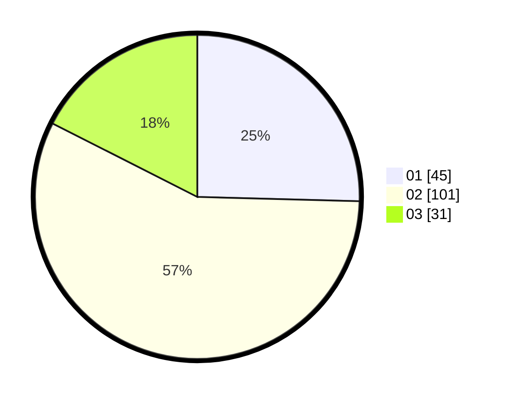

# Hasil

Hasil perolehan suara paslon dapat dilihat pada file paslon-01.txt, paslon-02.txt, dan paslon-03.txt.

Jika tidak ada, artinya data tersebut belum ada pada SIREKAP.

## Perolehan Suara

 * Paslon 01: **45**.
 * Paslon 02: **101**.
 * Paslon 03: **31**.

## Foto C Plano

https://sirekap-obj-formc.kpu.go.id/f2b7/pemilu/ppwp/31/72/01/10/01/3172011001152-20240214-211014--b07a84c7-70a9-4865-9c04-9fca6c55f2fd.jpg

https://sirekap-obj-formc.kpu.go.id/f2b7/pemilu/ppwp/31/72/01/10/01/3172011001152-20240214-225535--e0eb1139-2140-4451-9c43-4d35679c8394.jpg

https://sirekap-obj-formc.kpu.go.id/f2b7/pemilu/ppwp/31/72/01/10/01/3172011001152-20240214-211138--d7b1e8e3-568d-4947-a896-e69c2f6866c2.jpg

## DATA PEMILIH TETAP

Jumlah pemilih dalam DPT: **249**.
 * L: **119**.
 * P: **130**.

## DATA PENGGUNA HAK PILIH

Jumlah pengguna hak pilih dalam DPT: **178**.
 * L: **82**.
 * P: **96**.

Jumlah pengguna hak pilih dalam DPTb: **0**.
 * L: **0**.
 * P: **0**.

Jumlah pengguna hak pilih dalam DPK: **0**.
 * L: **0**.
 * P: **0**.

Jumlah pengguna hak pilih: **178**.
 * L: **82**.
 * P: **96**.

## JUMLAH SUARA SAH DAN TIDAK SAH

JUMLAH SELURUH SUARA SAH: **177**.

JUMLAH SUARA TIDAK SAH: **1**.

JUMLAH SELURUH SUARA SAH DAN SUARA TIDAK SAH: **178**.
