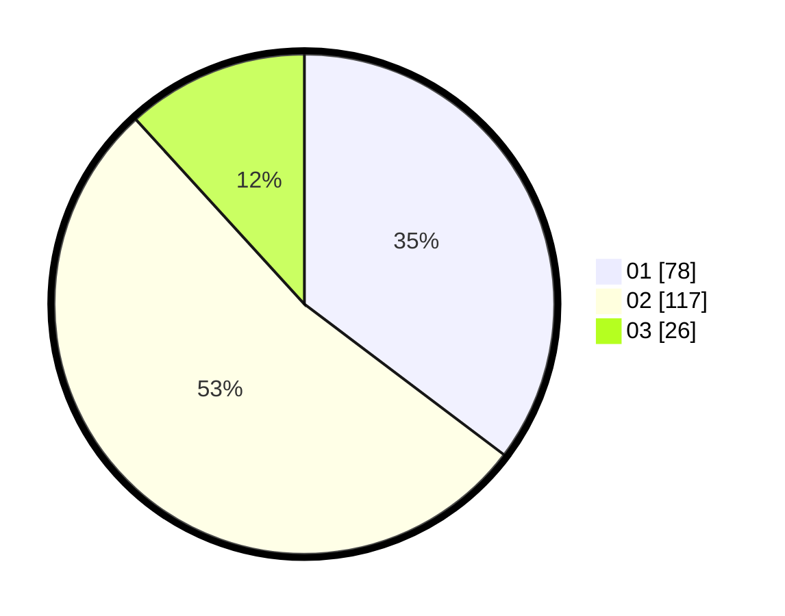

# Hasil

Hasil perolehan suara paslon dapat dilihat pada file paslon-01.txt, paslon-02.txt, dan paslon-03.txt.

Jika tidak ada, artinya data tersebut belum ada pada SIREKAP.

## Perolehan Suara

 * Paslon 01: **78**.
 * Paslon 02: **117**.
 * Paslon 03: **26**.

## Foto C Plano

https://sirekap-obj-formc.kpu.go.id/d59d/pemilu/ppwp/31/72/01/10/01/3172011001236-20240214-203120--86ae6e2b-3199-4977-bce6-ed41ade66b95.jpg

https://sirekap-obj-formc.kpu.go.id/d59d/pemilu/ppwp/31/72/01/10/01/3172011001236-20240215-002812--db2b1726-1832-4aa4-8f67-ca6c7c6e2edf.jpg

https://sirekap-obj-formc.kpu.go.id/d59d/pemilu/ppwp/31/72/01/10/01/3172011001236-20240215-002854--6da94249-41ed-4365-9ada-925659931185.jpg

## DATA PEMILIH TETAP

Jumlah pemilih dalam DPT: **290**.
 * L: **155**.
 * P: **135**.

## DATA PENGGUNA HAK PILIH

Jumlah pengguna hak pilih dalam DPT: **214**.
 * L: **110**.
 * P: **104**.

Jumlah pengguna hak pilih dalam DPTb: **10**.
 * L: **6**.
 * P: **4**.

Jumlah pengguna hak pilih dalam DPK: **0**.
 * L: **0**.
 * P: **0**.

Jumlah pengguna hak pilih: **224**.
 * L: **116**.
 * P: **108**.

## JUMLAH SUARA SAH DAN TIDAK SAH

JUMLAH SELURUH SUARA SAH: **224**.

JUMLAH SUARA TIDAK SAH: **47**.

JUMLAH SELURUH SUARA SAH DAN SUARA TIDAK SAH: **271**.
