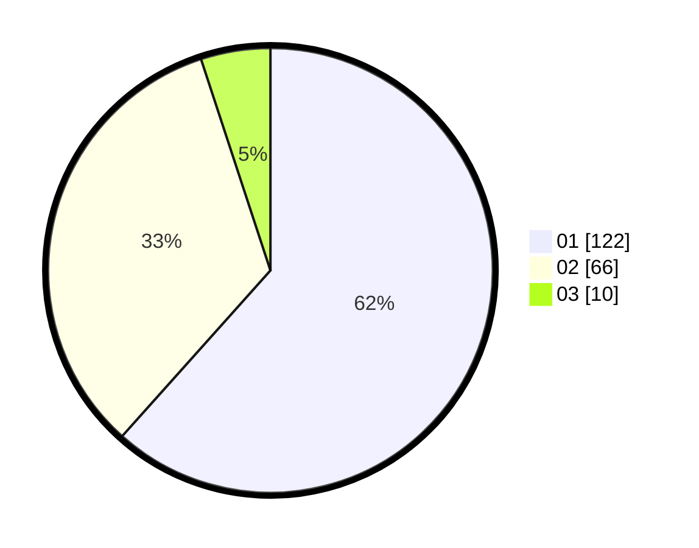

# Hasil

Hasil perolehan suara paslon dapat dilihat pada file paslon-01.txt, paslon-02.txt, dan paslon-03.txt.

Jika tidak ada, artinya data tersebut belum ada pada SIREKAP.

## Perolehan Suara

 * Paslon 01: **122**.
 * Paslon 02: **66**.
 * Paslon 03: **10**.

## Foto C Plano

https://sirekap-obj-formc.kpu.go.id/0abf/pemilu/ppwp/31/72/01/10/02/3172011002004-20240216-170548--d7d3c783-49a7-4cef-a29e-180a3f5a2b80.jpg

https://sirekap-obj-formc.kpu.go.id/0abf/pemilu/ppwp/31/72/01/10/02/3172011002004-20240216-170654--87cab670-1c3c-4f74-8f50-f94b5df163ff.jpg

https://sirekap-obj-formc.kpu.go.id/0abf/pemilu/ppwp/31/72/01/10/02/3172011002004-20240216-170737--586a8fcc-795f-4543-92da-e092099690ef.jpg

## DATA PEMILIH TETAP

Jumlah pemilih dalam DPT: **260**.
 * L: **136**.
 * P: **124**.

## DATA PENGGUNA HAK PILIH

Jumlah pengguna hak pilih dalam DPT: **200**.
 * L: **99**.
 * P: **101**.

Jumlah pengguna hak pilih dalam DPTb: **2**.
 * L: **1**.
 * P: **1**.

Jumlah pengguna hak pilih dalam DPK: **3**.
 * L: **2**.
 * P: **1**.

Jumlah pengguna hak pilih: **205**.
 * L: **102**.
 * P: **103**.

## JUMLAH SUARA SAH DAN TIDAK SAH

JUMLAH SELURUH SUARA SAH: **198**.

JUMLAH SUARA TIDAK SAH: **7**.

JUMLAH SELURUH SUARA SAH DAN SUARA TIDAK SAH: **205**.
