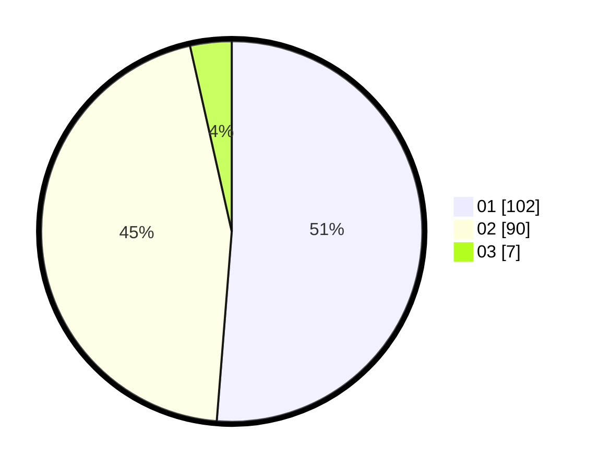

# Hasil

Hasil perolehan suara paslon dapat dilihat pada file paslon-01.txt, paslon-02.txt, dan paslon-03.txt.

Jika tidak ada, artinya data tersebut belum ada pada SIREKAP.

## Perolehan Suara

 * Paslon 01: **102**.
 * Paslon 02: **90**.
 * Paslon 03: **7**.

## Foto C Plano

https://sirekap-obj-formc.kpu.go.id/c849/pemilu/ppwp/31/72/01/10/02/3172011002007-20240216-180026--c7b9b1bb-90de-4c91-bfa1-a77ae3078e36.jpg

https://sirekap-obj-formc.kpu.go.id/c849/pemilu/ppwp/31/72/01/10/02/3172011002007-20240216-180257--d81cbad4-211a-469c-a1d3-0c6de6630f41.jpg

https://sirekap-obj-formc.kpu.go.id/c849/pemilu/ppwp/31/72/01/10/02/3172011002007-20240216-180138--e0b8ff30-340c-4503-89d4-213343eb7c4f.jpg

## DATA PEMILIH TETAP

Jumlah pemilih dalam DPT: **263**.
 * L: **131**.
 * P: **132**.

## DATA PENGGUNA HAK PILIH

Jumlah pengguna hak pilih dalam DPT: **199**.
 * L: **98**.
 * P: **101**.

Jumlah pengguna hak pilih dalam DPTb: **0**.
 * L: **0**.
 * P: **0**.

Jumlah pengguna hak pilih dalam DPK: **5**.
 * L: **2**.
 * P: **3**.

Jumlah pengguna hak pilih: **204**.
 * L: **100**.
 * P: **104**.

## JUMLAH SUARA SAH DAN TIDAK SAH

JUMLAH SELURUH SUARA SAH: **199**.

JUMLAH SUARA TIDAK SAH: **5**.

JUMLAH SELURUH SUARA SAH DAN SUARA TIDAK SAH: **204**.
