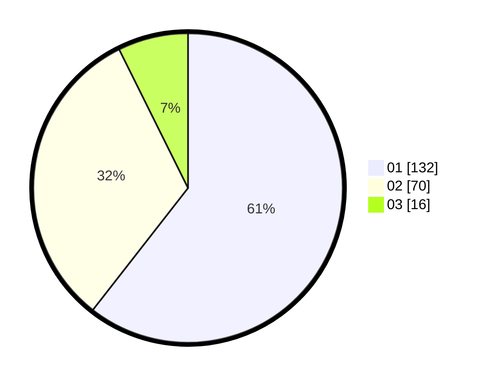

# Hasil

Hasil perolehan suara paslon dapat dilihat pada file paslon-01.txt, paslon-02.txt, dan paslon-03.txt.

Jika tidak ada, artinya data tersebut belum ada pada SIREKAP.

## Perolehan Suara

 * Paslon 01: **132**.
 * Paslon 02: **70**.
 * Paslon 03: **16**.

## Foto C Plano

https://sirekap-obj-formc.kpu.go.id/5085/pemilu/ppwp/31/72/01/10/02/3172011002010-20240216-200604--0483dd19-2c6a-40a2-9ca1-6e0ee3ab2503.jpg

https://sirekap-obj-formc.kpu.go.id/5085/pemilu/ppwp/31/72/01/10/02/3172011002010-20240216-200648--3236fd88-c5e0-4039-9b9d-83e85bbf8bc9.jpg

https://sirekap-obj-formc.kpu.go.id/5085/pemilu/ppwp/31/72/01/10/02/3172011002010-20240216-200738--5573b8e4-d7a4-43b0-a239-8685d63e0430.jpg

## DATA PEMILIH TETAP

Jumlah pemilih dalam DPT: **249**.
 * L: **135**.
 * P: **114**.

## DATA PENGGUNA HAK PILIH

Jumlah pengguna hak pilih dalam DPT: **217**.
 * L: **113**.
 * P: **104**.

Jumlah pengguna hak pilih dalam DPTb: **3**.
 * L: **1**.
 * P: **2**.

Jumlah pengguna hak pilih dalam DPK: **0**.
 * L: **0**.
 * P: **0**.

Jumlah pengguna hak pilih: **220**.
 * L: **114**.
 * P: **106**.

## JUMLAH SUARA SAH DAN TIDAK SAH

JUMLAH SELURUH SUARA SAH: **218**.

JUMLAH SUARA TIDAK SAH: **2**.

JUMLAH SELURUH SUARA SAH DAN SUARA TIDAK SAH: **220**.
