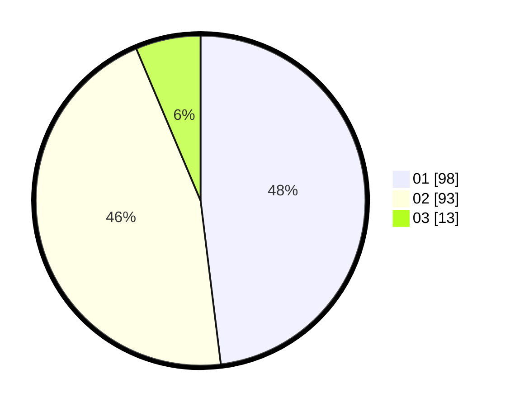

# Hasil

Hasil perolehan suara paslon dapat dilihat pada file paslon-01.txt, paslon-02.txt, dan paslon-03.txt.

Jika tidak ada, artinya data tersebut belum ada pada SIREKAP.

## Perolehan Suara

 * Paslon 01: **98**.
 * Paslon 02: **93**.
 * Paslon 03: **13**.

## Foto C Plano

https://sirekap-obj-formc.kpu.go.id/0881/pemilu/ppwp/31/72/01/10/02/3172011002011-20240216-201950--4b700688-14b5-4690-ba03-c9ce73702cd2.jpg

https://sirekap-obj-formc.kpu.go.id/0881/pemilu/ppwp/31/72/01/10/02/3172011002011-20240216-202022--14307c0b-7825-4543-8f34-47e3dbc443be.jpg

https://sirekap-obj-formc.kpu.go.id/0881/pemilu/ppwp/31/72/01/10/02/3172011002011-20240216-202052--5e7805ee-18e3-4b4e-80ae-b92daf494067.jpg

## DATA PEMILIH TETAP

Jumlah pemilih dalam DPT: **249**.
 * L: **125**.
 * P: **124**.

## DATA PENGGUNA HAK PILIH

Jumlah pengguna hak pilih dalam DPT: **209**.
 * L: **102**.
 * P: **107**.

Jumlah pengguna hak pilih dalam DPTb: **0**.
 * L: **0**.
 * P: **0**.

Jumlah pengguna hak pilih dalam DPK: **0**.
 * L: **0**.
 * P: **0**.

Jumlah pengguna hak pilih: **209**.
 * L: **102**.
 * P: **107**.

## JUMLAH SUARA SAH DAN TIDAK SAH

JUMLAH SELURUH SUARA SAH: **204**.

JUMLAH SUARA TIDAK SAH: **5**.

JUMLAH SELURUH SUARA SAH DAN SUARA TIDAK SAH: **209**.
